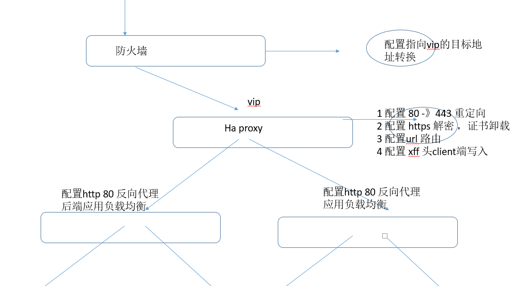
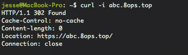
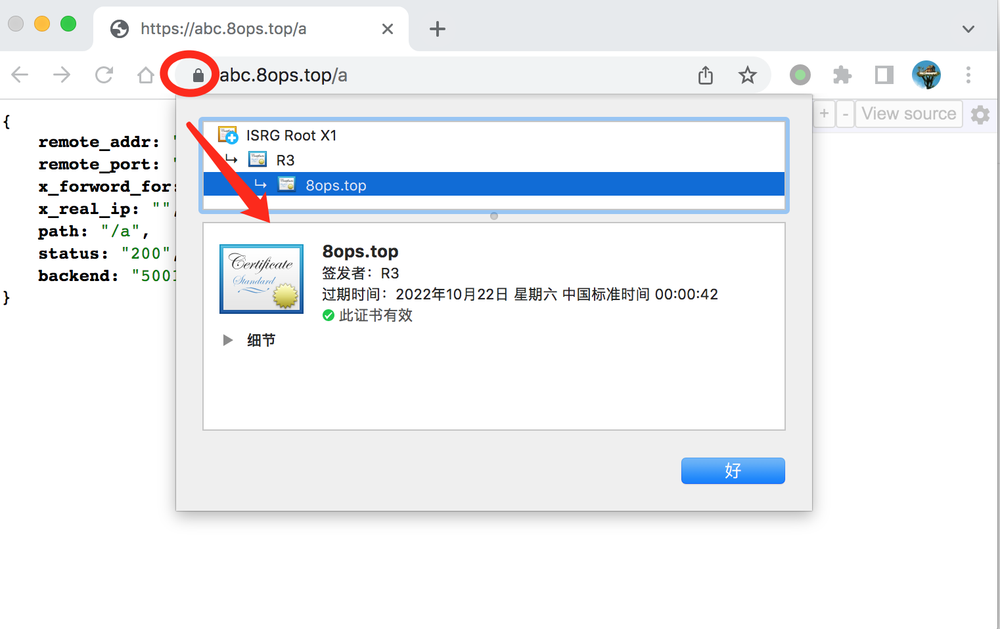
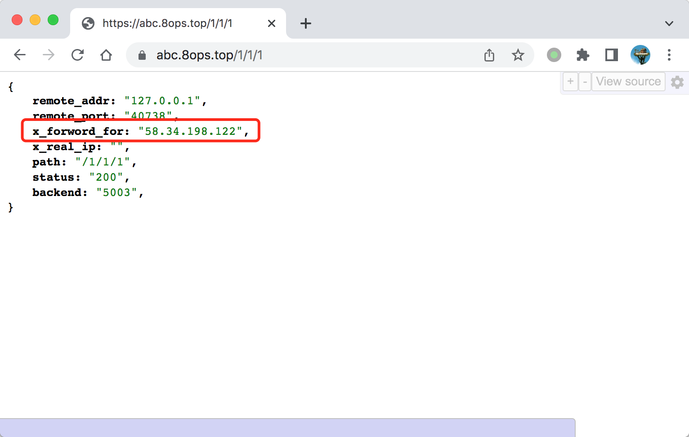
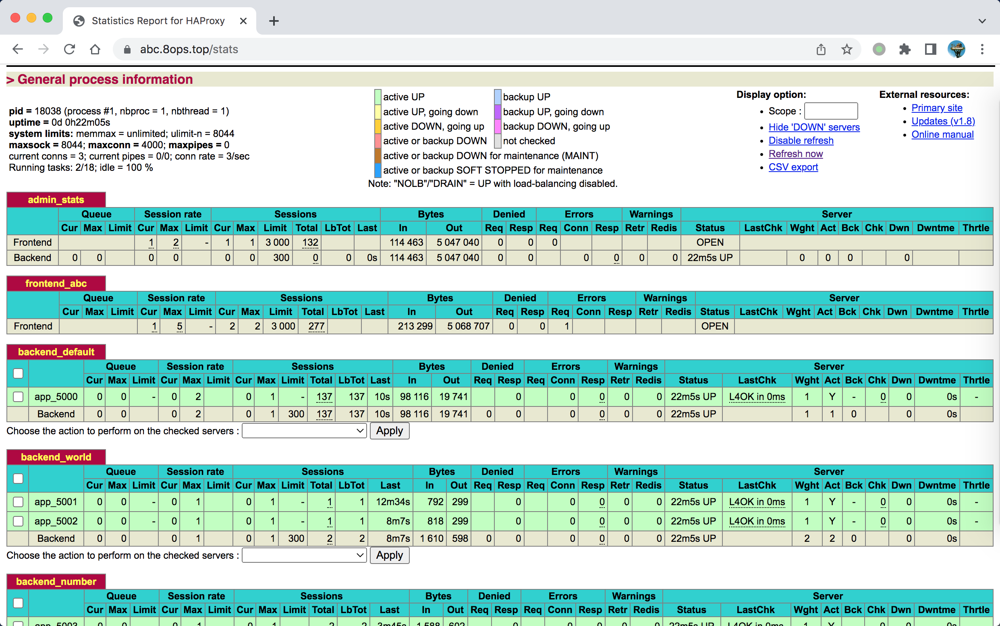

# Haproxy


## 一、背景描述

> 结构和预期效果




> 模拟设定

- 此处模拟入口域名 `abc.8ops.top`
- 后端服务 `backend_world` 由`127.0.0.1:5001`和`127.0.0.1:5002`两个实例提供服务
- 后端服务 `backend_number` 由`127.0.0.1:5003`和`127.0.0.1:5004`两个实例提供服务
- 负载策略支持轮洵、最少连接、相应权重，此处演示轮洵


## 二、演示效果


### 2.1 效果一：80->443 重定向



### 2.2 效果二：HTTPS



### 2.3 效果三：URL路由

> 路由列表

- 路由1：/a, /b, /c 分发到后端服务 `backend_world`
- 路由2：/1, /2, /3 分发到后端服务 `backend_number`


### 2.4 效果四：XFF客户端写入





## 三、控制台




## 四、配置

```bash
global
    log         127.0.0.1 local2

    chroot      /var/lib/haproxy
    pidfile     /var/run/haproxy.pid
    maxconn     4000
    user        haproxy
    group       haproxy
    daemon

    # turn on stats unix socket
    stats socket /var/lib/haproxy/stats

    # utilize system-wide crypto-policies
    ssl-default-bind-ciphers PROFILE=SYSTEM
    ssl-default-server-ciphers PROFILE=SYSTEM

    tune.ssl.default-dh-param 2048

#---------------------------------------------------------------------
# common defaults that all the 'listen' and 'backend' sections will
# use if not designated in their block
#---------------------------------------------------------------------
defaults
    mode                    http
    log                     global
    option                  httplog
    option                  dontlognull
    option http-server-close
    option forwardfor       except 127.0.0.0/8
    option                  redispatch
    retries                 3
    timeout http-request    10s
    timeout queue           1m
    timeout connect         10s
    timeout client          1m
    timeout server          1m
    timeout http-keep-alive 10s
    timeout check           10s
    maxconn                 3000

listen admin_stats
    mode http
    bind 0.0.0.0:9200
    stats enable
    log global
    stats refresh 10s
    stats uri /stats
    stats realm Haproxy Manager
    stats auth admin:8ops
    stats hide-version
    stats admin if TRUE

#---------------------------------------------------------------------
# main frontend which proxys to the backends
#---------------------------------------------------------------------
frontend frontend_abc
    mode http
    bind :80
    bind :443 ssl crt /opt/static/8ops.top.pem
    bind :::80
    bind :::443 ssl crt /opt/static/8ops.top.pem
    http-request redirect scheme https unless { ssl_fc }

    # acl hdr_abc hdr -i abc.8ops.top
    # acl hdr_abc hdr_dom(host) -i abc.8ops.top
    acl hdr_abc hdr_beg(host) -i abc.8ops.top
    option  forwardfor
    option  forceclose
    option  httplog
    
    acl uri_world     path_beg       -i  /a /b /c
    acl uri_number    path_beg       -i  /1 /2 /3
    acl uri_stats     path_beg       -i /stats

    use_backend       backend_world  if uri_world
    use_backend       backend_number if uri_number
    use_backend       backend_stats  if uri_stats
    default_backend                  backend_default

backend backend_default
    balance roundrobin
    server  app_5000 127.0.0.1:5000 check

backend backend_world
    balance roundrobin
    server  app_5001 127.0.0.1:5001 check
    server  app_5002 127.0.0.1:5002 check

backend backend_number
    balance roundrobin
    server  app_5003 127.0.0.1:5003 check
    server  app_5004 127.0.0.1:5004 check

backend backend_stats
    server  app  127.0.0.1:9200 check

```

