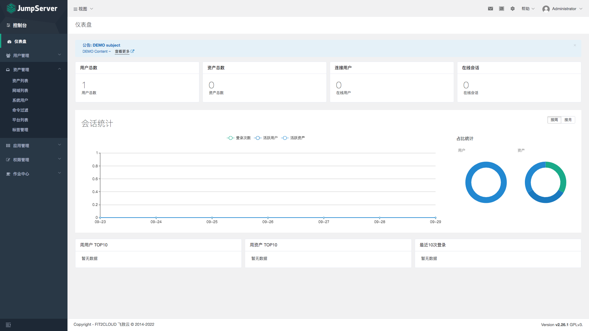

# JumpServer

[Reference](https://www.jumpserver.org/index.html)

## 一、效果预览

- https://jumpserver.8ops.top
- http://jumpserver.8ops.top/api/docs

`jesse2021`



> 终端登录

```bash
# default ssh port 2222
ssh -p2222 jesse@10.101.11.236
```


## 二、安装方式

### 2.1 Helm

`unsucess`

- [MySQL](/kubernetes/21-mysql.md)
- [Redis](/kubernetes/24-redis.md)


```bash
helm repo add jumpserver https://jumpserver.github.io/helm-charts
help repo update jumpserver
helm search repo jumpserver
helm show values jumpserver/jumpserver > jumpserver.yaml-2.26.1-default

# Example
#    https://m.8ops.top/attachment/jumpserver/helm/jumpserver.yaml-2.26.1
# 

helm install jumpserver jumpserver/jumpserver \
    -f jumpserver.yaml-2.26.1 \
    -n kube-server \
    --version 2.26.1 \
    --debug

helm -n kube-server uninstall jumpserver
```


### 2.2 OneKey

```bash
# 默认会安装到 /opt/jumpserver-installer-v2.26.1 目录
curl -sSL https://github.com/jumpserver/jumpserver/releases/download/v2.26.1/quick_start.sh | bash

cd /opt/jumpserver-installer-v2.26.1

# tree jumpserver/config/
jumpserver/config/
├── config.txt
├── core
│   └── config.yml
├── koko
│   └── config.yml
├── mariadb
│   └── mariadb.cnf
├── mysql
│   └── my.cnf
├── nginx
│   ├── cert
│   │   ├── server.crt
│   │   └── server.key
│   └── lb_http_server.conf
└── redis
    └── redis.conf
    
# 维护
jmsctl stop 
jmsctl start 
jmsctl status
```


