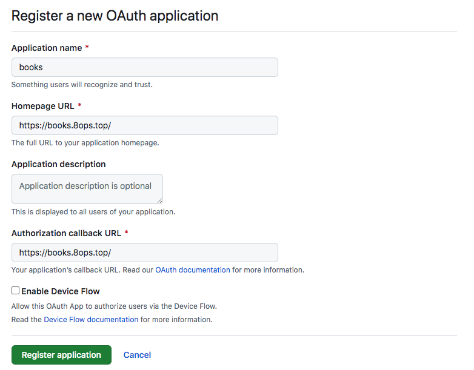

# mkdocs

[Reference](https://github.com/squidfunk/mkdocs-material)

## 一、 安装向导

```bash
pip install mkdocs

mkdocs new guide
cd guide
mkdocs serve

pip install mkdocs-material
pip install mkdocs-minify-plugin 

mkdocs gh-deploy --force
```


## 二、添加评论

这里使用 [Gitalk](https://github.com/gitalk/gitalk)

### 2.1 申请 ClientID+ClientSecret

[Reference](https://github.com/settings/applications/new)



### 2.2 添加模板

> vim mkdocs.yml

```bash
……
theme:
  name: material
  custom_dir: templates
……
```


> vim templates/main.html

```bash



  {{ super() }}
<h2 id="__comments">{{ lang.t("meta.comments") }}</h2>
  <link rel="stylesheet" href="https://unpkg.com/gitalk/dist/gitalk.css">
  <script src="https://unpkg.com/gitalk/dist/gitalk.min.js"></script>
  <div id="gitalk-container"></div>

  <script>
const gitalk = new Gitalk({
  clientID: 'xx',
  clientSecret: 'xx',
  repo: 'mkdocs',
  owner: '8ops',
  admin: ['xtso520ok'],
  id: location.pathname,
  distractionFreeMode: false
})

gitalk.render('gitalk-container')
  </script>

```


## 三、编辑效果

[Reference](https://squidfunk.github.io/mkdocs-material/reference)

### 3.1 常规效果

```bash
- 加粗 bold
- 斜体字 斜体字
- 加粗斜体 粗斜体
- 下划线 ^^Insert me^^
- 删除线 Delete me
- 增加 {++ add ++}
- 修改 {~ is ~> are ~}
- 删除 {– del –}
- 高亮 {== highlight ==}
- 注释 {>> comment <<}
- 上标 H^2^O, text^a\ superscript^
- 下标 CH3CH2OH, texta\ subscript
- 行内代码高亮：:::java System.out.println("hello"); or #!python println('hello')
- 键盘快捷键标签：++ctrl+alt+f++
```

- 加粗 bold
- 斜体字 斜体字
- 加粗斜体 粗斜体
- 下划线 ^^Insert me^^
- 删除线 Delete me
- 增加 {++ add ++}
- 修改 {~ is ~> are ~}
- 删除 {– del –}
- 高亮 {== highlight ==}
- 注释 {>> comment <<}
- 上标 H^2^O, text^a\ superscript^
- 下标 CH3CH2OH, texta\ subscript
- 行内代码高亮：:::java System.out.println("hello"); or #!python println('hello')
- 键盘快捷键标签：++ctrl+alt+f++


### 3.2 复选框

```bash
- [x] a
- [ ] b
- [x] c
```

- [x] a
- [ ] b
- [x] c

### 3.3 数学表达式

```bash
$a^2$
```

$a^2$

### 3.3 特别提示

```bash
# 特别提示
!!! note "custom title or blank"
    text

# 其他效果
??? abstract "摘要，总结" abstract, summary, tldr
??? tip "贴士" tip, hint, important
??? note "注释，代码片段，说明" note, snippet, seealso
??? example "举例，列表" example
??? quote "引用，参考链接" quote, cite
??? info "提示，TODO" info, todo
??? warning "警告" warning, caution, attention
??? danger "危险" danger, error
??? success "成功，勾选，完成" success, check, done
??? fail "失败" failure, fail, missing
??? faq "问题，疑问，帮助" question, help, faq
??? bug "BUG" bug    

# 可折叠，+默认打开
???+ danger highlight blink "custom title or blank"
    text vtext text, text, v<br>
    text vtext text, text, v
    #```python
    # text1 = "Hello, "
    # text2 = "world!"
    # print text1 + text2
    #```

```


!!! note "custom title or blank"
    text


可折叠，+默认打开

???+ danger highlight blink "custom title or blank"
    text vtext text, text, v<br>
    text vtext text, text, v

    ```python
    text1 = "Hello, "
    text2 = "world!"
    print text1 + text2
    ```
