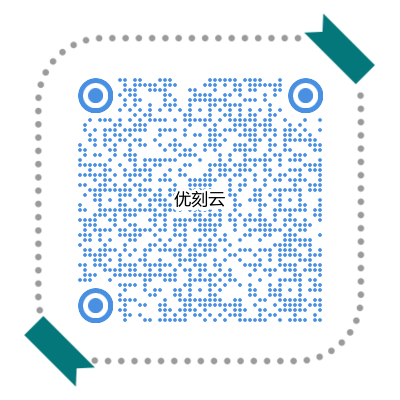
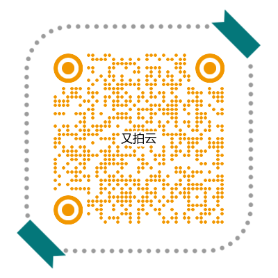

---
hide:
- navigation
---

# 欢迎来到运维虾的世界 

!!! info "重新沉淀、重构文章、继续传递"
    - 通过持续有效的运动来保持身材
    - 通过正确及时的学习来保持精进
    - 通过和更优秀的人建立圈层效益互相赋能

## 分站列表

| 分站                   | 地址                                            |
| ---------------------- | ----------------------------------------------- |
| 笔记 | https://books.8ops.top |
| 笔记 - docsify | <https://docsify.8ops.top/>                |
| 笔记 - docsify | <https://8ops.github.io/docsify>            |
| 笔记^{mkdocs}$ | <https://mkdocs.8ops.top/> |
| 笔记^{mkdocs | <https://8ops.github.io/mkdocs/> |
| Json格式化 - jsonviewer | <https://jsonviewer.8ops.top>                   |
| Json格式化 - bejson | <https://jsonviewer.8ops.top/bejson/index.html> |
| 图形设计        | <https://asciiflow.8ops.top/> |

## 推荐优惠

===  "阿里云（Aliyun）"
    

===  "优刻云（UCloud）"
    

===  "又拍云（Upyun）"
    

<u>为生民立命，为天地立心，为往圣继绝学，为万世开太平。</u>

