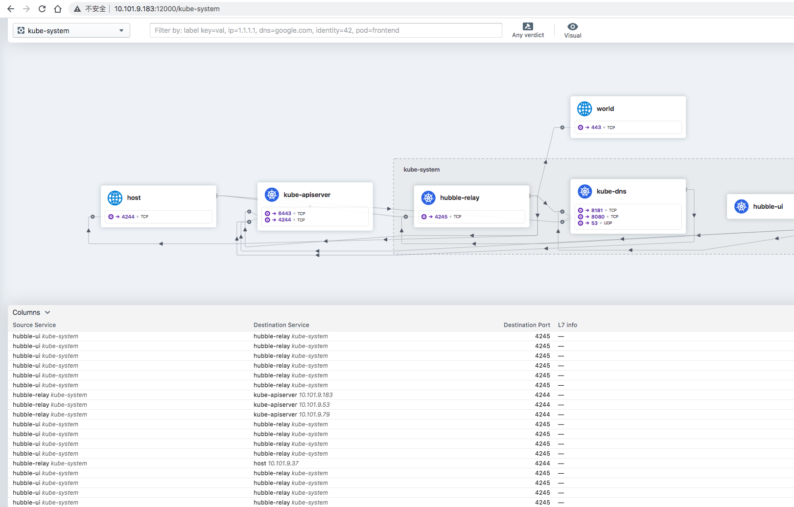

# Quick Start - Cilium

[Reference](01-cluster-init.md)


> 当前各软件版本

| 名称       | 版本    |
| ---------- | ------- |
| ubuntu     | v22.04  |
| kubernetes | v1.25.3 |
| cilium     | v0.12.2 |
| hubble     | v0.10.0 |
| containerd |         |

- 这里操作系统选择 `20.04`


## 一、准备资源

### 1.1 VIP

通过 `haproxy` 代理 `apiserver` 多节点

**10.101.11.110**


### 1.2 服务器

| 角色          | 服务器地址    |
| ------------- | ------------- |
| control-plane | 10.101.11.240 |
| control-plane | 10.101.11.114 |
| control-plane | 10.101.11.154 |
| work-node     | 10.101.11.196 |
| work-node     | 10.101.11.157 |
| work-node     | 10.101.11.250 |


## 二、搭建集群

[Reference](01-cluster-init.md)

> pull repo 

```bash
{
  "registry.cn-hangzhou.aliyuncs.com/google_containers/kube-apiserver:v1.25.2":"hub.8ops.top/google_containers/kube-apiserver",
  "registry.cn-hangzhou.aliyuncs.com/google_containers/kube-controller-manager:v1.25.2":"hub.8ops.top/google_containers/kube-controller-manager",
  "registry.cn-hangzhou.aliyuncs.com/google_containers/kube-scheduler:v1.25.2":"hub.8ops.top/google_containers/kube-scheduler",
  "registry.cn-hangzhou.aliyuncs.com/google_containers/kube-proxy:v1.25.2":"hub.8ops.top/google_containers/kube-proxy",
  "registry.cn-hangzhou.aliyuncs.com/google_containers/pause:3.8":"hub.8ops.top/google_containers/pause",
  "registry.cn-hangzhou.aliyuncs.com/google_containers/etcd:3.5.4-0":"hub.8ops.top/google_containers/etcd",
  "registry.cn-hangzhou.aliyuncs.com/google_containers/coredns:v1.9.3":"hub.8ops.top/google_containers/coredns"
}
```


### 2.1 初始化环境

```bash
curl -s https://books.8ops.top/attachment/kubernetes/bin/01-init.sh | bash
```


### 2.2 调整lib目录

```bash
# containerd
mkdir -p /data1/lib/containerd && \
    ([ -e /var/lib/containerd ] && mv /var/lib/containerd{,-$(date +%Y%m%d)} || /bin/true) && \
    ln -s /data1/lib/containerd /var/lib/containerd
ls -l /var/lib/containerd

# kubelet
mkdir -p /data1/lib/kubelet && \
    ([ -e /var/lib/kubelet ] && mv /var/lib/kubelet{,-$(date +%Y%m%d)} || /bin/true) && \
    ln -s /data1/lib/kubelet /var/lib/kubelet
ls -l /var/lib/kubelet   

# etcd（仅需要在 control-plane）
mkdir -p /data1/lib/etcd && \
    ([ -e /var/lib/etcd ] && mv /var/lib/etcd{,-$(date +%Y%m%d)} || /bin/true) && \
    ln -s /data1/lib/etcd /var/lib/etcd
ls -l /var/lib/etcd
```


### 2.3 安装容器运行时

```bash
CONTAINERD_VERSION=1.5.9-0ubuntu1~20.04.4
apt install -y containerd=${CONTAINERD_VERSION}

apt-mark hold containerd
apt-mark showhold
dpkg -l | grep containerd

# 替换 ctr 运行时
mkdir -p /etc/containerd
containerd config default > /etc/containerd/config.toml-default
cp /etc/containerd/config.toml-default /etc/containerd/config.toml

sed -i 's#sandbox_image.*$#sandbox_image = "hub.8ops.top/google_containers/pause:3.6"#' /etc/containerd/config.toml  
sed -i 's#SystemdCgroup = false#SystemdCgroup = true#' /etc/containerd/config.toml 
grep -P 'sandbox_image|SystemdCgroup' /etc/containerd/config.toml  
systemctl restart containerd
systemctl status containerd
```


### 2.4 安装 kube 环境

```bash
# kubeadm
KUBERNETES_VERSION=1.25.0-00
apt install -y -q kubeadm=${KUBERNETES_VERSION} kubectl=${KUBERNETES_VERSION} kubelet=${KUBERNETES_VERSION}
apt-mark hold kubeadm kubectl kubelet
apt-mark showhold
dpkg -l | grep kube

# 用于运行 crictl
cat > /etc/crictl.yaml <<EOF
runtime-endpoint: unix:///run/containerd/containerd.sock
image-endpoint: unix:///run/containerd/containerd.sock
timeout: 10
debug: false
EOF

systemctl restart containerd
crictl images
crictl ps -a

# config
kubeadm config print init-defaults > kubeadm-init.yaml-default

kubeadm config images list -v 5
kubeadm config images list --config kubeadm-init.yaml -v 5
kubeadm config images pull --config kubeadm-init.yaml -v 5

# 初始集群（仅需要在其中一台 control-plane 节点操作）
kubeadm init --config kubeadm-init.yaml --upload-certs -v 5

mkdir -p ~/.kube && ln -s /etc/kubernetes/admin.conf ~/.kube/config 

# 添加节点 control-plane
kubeadm join 10.101.9.111:6443 --token abcdef.0123456789abcdef \
    --discovery-token-ca-cert-hash sha256:2c6210399be45c5d2ecaf37eb37765400bc4f1588b958cf82c9a242e04c6409c \
    --control-plane --certificate-key 379790710e66c402b48abf3476c649f085273c8850e8c0cd31ddb4213373a273

# 添加节点 work-node
kubeadm join 10.101.9.111:6443 --token abcdef.0123456789abcdef \
    --discovery-token-ca-cert-hash sha256:2c6210399be45c5d2ecaf37eb37765400bc4f1588b958cf82c9a242e04c6409c
```

> 编辑 kubeadm-init.yaml

```bash
apiVersion: kubeadm.k8s.io/v1beta3
bootstrapTokens:
- groups:
  - system:bootstrappers:kubeadm:default-node-token
  token: abcdef.0123456789abcdef
  ttl: 24h0m0s
  usages:
  - signing
  - authentication
kind: InitConfiguration
localAPIEndpoint:
  advertiseAddress: 10.101.9.183
  bindPort: 6443
nodeRegistration:
  criSocket: unix:///var/run/containerd/containerd.sock
  imagePullPolicy: IfNotPresent
  name: K-LAB-K8S-MASTER-01
  taints: null
---
apiServer:
  timeoutForControlPlane: 4m0s
apiVersion: kubeadm.k8s.io/v1beta3
certificatesDir: /etc/kubernetes/pki
clusterName: kubernetes
controllerManager: {}
dns:
  imageRepository: hub.8ops.top/google_containers
  imageTag: v1.9.3
etcd:
  local:
    dataDir: /var/lib/etcd
imageRepository: hub.8ops.top/google_containers
kind: ClusterConfiguration
kubernetesVersion: 1.25.0
controlPlaneEndpoint: 10.101.9.111:6443
networking:
  dnsDomain: cluster.local
  podSubnet: 172.20.0.0/16
  serviceSubnet: 192.168.0.0/16
scheduler: {}
---
apiVersion: kubelet.config.k8s.io/v1beta1
kind: KubeletConfiguration
cgroupDriver: systemd
---
apiVersion: kubeproxy.config.k8s.io/v1alpha1
kind: KubeProxyConfiguration
mode: ipvs
```


## 三、应用 Cilium

> Reference

- [cilium](https://github.com/cilium/cilium)
- [hubble](https://github.com/cilium/hubble)
- [tingchen](https://tinychen.com/20220510-k8s-04-deploy-k8s-with-cilium/)

> pull repo

```bash
{
  "quay.io/cilium/cilium:v1.12.1":"hub.8ops.top/google_containers/cilium",
  "quay.io/cilium/certgen:v0.1.8":"hub.8ops.top/google_containers/certgen",
  "quay.io/cilium/hubble-relay:v1.12.1":"hub.8ops.top/google_containers/hubble-relay",
  "quay.io/cilium/hubble-ui-backend:v0.9.1":"hub.8ops.top/google_containers/hubble-ui-backend",
  "quay.io/cilium/hubble-ui:v0.9.1":"hub.8ops.top/google_containers/hubble-ui",
  "quay.io/cilium/operator:v1.12.1":"hub.8ops.top/google_containers/cilium-operator",
  "quay.io/cilium/operator-generic:v1.12.1":"hub.8ops.top/google_containers/cilium-operator-generic"
}
```


### 3.1 工具安装

```bash
# 配置环境
export PATH=~/bin:$PATH
echo 'export PATH=~/bin:$PATH' >> ~/.bashrc

# CILIUM
# https://raw.githubusercontent.com/cilium/cilium-cli/master/stable.txt
CILIUM_VERSION=v0.12.2
curl -sL --remote-name-all https://github.com/cilium/cilium-cli/releases/download/${CILIUM_VERSION}/cilium-linux-amd64.tar.gz{,.sha256sum}
sha256sum --check cilium-linux-amd64.tar.gz.sha256sum
tar xzvfC cilium-linux-amd64.tar.gz ~/bin

# 安装 cilium，等同于
#    helm template --namespace kube-system cilium cilium/cilium --version 1.12.2 --set cluster.id=0,cluster.name=kubernetes,encryption.nodeEncryption=false,ipam.mode=cluster-pool,kubeProxyReplacement=disabled,operator.replicas=1,serviceAccounts.cilium.name=cilium,serviceAccounts.operator.name=cilium-operator
cilium install

# 查看 cilium 状态
cilium status

# 部署 hubble
cilium hubble enable

# HUBBLE
# https://raw.githubusercontent.com/cilium/hubble/master/stable.txt
HUBBLE_VERSION=v0.10.0
curl -sL --remote-name-all https://github.com/cilium/hubble/releases/download/${HUBBLE_VERSION}/hubble-linux-amd64.tar.gz{,.sha256sum}
sha256sum --check hubble-linux-amd64.tar.gz.sha256sum
tar xzvfC hubble-linux-amd64.tar.gz ~/bin

# 开启 hubble 的 api
# 同时开启转发，等同于
#    kubectl port-forward -n kube-system svc/hubble-relay --address 0.0.0.0 --address :: 4245:80
cilium hubble port-forward &

# 查看 hubble 状态
hubble status

# 查看数据转发情况
hubble observe

# 开启 hubble ui 组件，等同于
#    helm template --namespace kube-system cilium cilium/cilium --version 1.11.3 --set cluster.id=0,cluster.name=kubernetes,encryption.nodeEncryption=false,hubble.enabled=true,hubble.relay.enabled=true,hubble.tls.ca.cert=LS0tLS1CRUdJTiBDRVJUSUZJQ0FURS0tLS0tCk1JSUNGRENDQWJxZ0F3SUJBZ0lVSDRQcit1UU0xSXZtdWQvVlV3YWlycGllSEZBd0NnWUlLb1pJemowRUF3SXcKYURFTE1Ba0dBMVVFQmhNQ1ZWTXhGakFVQmdOVkJBZ1REVk5oYmlCR2NtRnVZMmx6WTI4eEN6QUpCZ05WQkFjVApBa05CTVE4d0RRWURWUVFLRXdaRGFXeHBkVzB4RHpBTkJnTlZCQXNUQmtOcGJHbDFiVEVTTUJBR0ExVUVBeE1KClEybHNhWFZ0SUVOQk1CNFhEVEl5TURVd09UQTVNREF3TUZvWERUSTNNRFV3T0RBNU1EQXdNRm93YURFTE1Ba0cKQTFVRUJoTUNWVk14RmpBVUJnTlZCQWdURFZOaGJpQkdjbUZ1WTJselkyOHhDekFKQmdOVkJBY1RBa05CTVE4dwpEUVlEVlFRS0V3WkRhV3hwZFcweER6QU5CZ05WQkFzVEJrTnBiR2wxYlRFU01CQUdBMVVFQXhNSlEybHNhWFZ0CklFTkJNRmt3RXdZSEtvWkl6ajBDQVFZSUtvWkl6ajBEQVFjRFFnQUU3Z21EQ05WOERseEIxS3VYYzhEdndCeUoKWUxuSENZNjVDWUhBb3ZBY3FUM3drcitLVVNwelcyVjN0QW9IaFdZV0UyQ2lUNjNIOXZLV1ZRY3pHeXp1T0tOQwpNRUF3RGdZRFZSMFBBUUgvQkFRREFnRUdNQThHQTFVZEV3RUIvd1FGTUFNQkFmOHdIUVlEVlIwT0JCWUVGQmMrClNDb3F1Y0JBc09sdDBWaEVCbkwyYjEyNE1Bb0dDQ3FHU000OUJBTUNBMGdBTUVVQ0lRRDJsNWVqaDVLVTkySysKSHJJUXIweUwrL05pZ3NSUHRBblA5T3lDcHExbFJBSWdYeGY5a2t5N2xYU0pOYmpkREFjbnBrNlJFTFp2eEkzbQpKaG9JRkRlbER0dz0KLS0tLS1FTkQgQ0VSVElGSUNBVEUtLS0tLQo=,hubble.tls.ca.key=[--- REDACTED WHEN PRINTING TO TERMINAL (USE --redact-helm-certificate-keys=false TO PRINT) ---],hubble.ui.enabled=true,hubble.ui.securityContext.enabled=false,ipam.mode=cluster-pool,kubeProxyReplacement=disabled,operator.replicas=1,serviceAccounts.cilium.name=cilium,serviceAccounts.operator.name=cilium-operator
cilium hubble enable --ui 
# 若提示 service/hubble-peer 已经存在，可手动删除后再启动 kubectl -n kube-system delete svc hubble-peer

# 开启端口转发，等同于
#    kubectl port-forward -n kube-system svc/hubble-ui --address 0.0.0.0 --address :: 12000:80
cilium hubble ui &

```

>Output

```bash
root@K-LAB-K8S-MASTER-01:~# cilium status
    /¯¯\
 /¯¯\__/¯¯\    Cilium:         OK
 \__/¯¯\__/    Operator:       OK
 /¯¯\__/¯¯\    Hubble:         OK
 \__/¯¯\__/    ClusterMesh:    disabled
    \__/

Deployment        hubble-relay       Desired: 1, Ready: 1/1, Available: 1/1
Deployment        cilium-operator    Desired: 1, Ready: 1/1, Available: 1/1
Deployment        hubble-ui          Desired: 1, Ready: 1/1, Available: 1/1
DaemonSet         cilium             Desired: 4, Ready: 4/4, Available: 4/4
Containers:       cilium             Running: 4
                  hubble-relay       Running: 1
                  cilium-operator    Running: 1
                  hubble-ui          Running: 1
Cluster Pods:     4/4 managed by Cilium
Image versions    cilium             quay.io/cilium/cilium:v1.12.1@sha256:ea2db1ee21b88127b5c18a96ad155c25485d0815a667ef77c2b7c7f31cab601b: 4
                  hubble-relay       quay.io/cilium/hubble-relay:v1.12.1@sha256:646582b22bf41ad29dd7739b12aae77455ee5757b9ee087f2d45d684afef5fa1: 1
                  cilium-operator    quay.io/cilium/operator-generic:v1.12.1@sha256:93d5aaeda37d59e6c4325ff05030d7b48fabde6576478e3fdbfb9bb4a68ec4a1: 1
                  hubble-ui          quay.io/cilium/hubble-ui:v0.9.1@sha256:baff611b975cb12307a163c0e547e648da211384eabdafd327707ff2ec31cc24: 1
                  hubble-ui          quay.io/cilium/hubble-ui-backend:v0.9.1@sha256:c4b86e0d7a38d52c6ea3d9d7b17809e5212efd97494e8bd37c8466ddd68d42d0: 1
                  
root@K-LAB-K8S-MASTER-01:~# kubectl -n kube-system get all
NAME                                                READY   STATUS    RESTARTS   AGE
pod/cilium-dwq2w                                    1/1     Running   0          137m
pod/cilium-hlwl6                                    1/1     Running   0          137m
pod/cilium-operator-69b677f97c-ktj47                1/1     Running   0          4h
pod/cilium-t2nwf                                    1/1     Running   0          137m
pod/cilium-tnlbb                                    1/1     Running   0          137m
pod/coredns-b55fcbd7b-ntjg6                         1/1     Running   0          4h16m
pod/coredns-b55fcbd7b-rktpx                         1/1     Running   0          4h16m
pod/etcd-gat-lab-k8s-master-01                      1/1     Running   1          4h16m
pod/etcd-gat-lab-k8s-master-02                      1/1     Running   0          4h15m
pod/etcd-gat-lab-k8s-master-03                      1/1     Running   0          4h14m
pod/hubble-relay-59d8575-hpbl7                      1/1     Running   0          3h18m
pod/hubble-ui-64d4995d57-n7bpq                      2/2     Running   0          136m
pod/kube-apiserver-gat-lab-k8s-master-01            1/1     Running   1          4h16m
pod/kube-apiserver-gat-lab-k8s-master-02            1/1     Running   0          4h15m
pod/kube-apiserver-gat-lab-k8s-master-03            1/1     Running   0          4h14m
pod/kube-controller-manager-gat-lab-k8s-master-01   1/1     Running   1          4h16m
pod/kube-controller-manager-gat-lab-k8s-master-02   1/1     Running   0          4h14m
pod/kube-controller-manager-gat-lab-k8s-master-03   1/1     Running   0          4h14m
pod/kube-proxy-5652c                                1/1     Running   0          4h14m
pod/kube-proxy-bdqfv                                1/1     Running   0          4h16m
pod/kube-proxy-mhtlj                                1/1     Running   0          4h13m
pod/kube-proxy-qtdhk                                1/1     Running   0          4h15m
pod/kube-scheduler-gat-lab-k8s-master-01            1/1     Running   1          4h16m
pod/kube-scheduler-gat-lab-k8s-master-02            1/1     Running   0          4h15m
pod/kube-scheduler-gat-lab-k8s-master-03            1/1     Running   0          4h14m

NAME                   TYPE        CLUSTER-IP        EXTERNAL-IP   PORT(S)                  AGE
service/hubble-peer    ClusterIP   192.168.97.223    <none>        443/TCP                  136m
service/hubble-relay   ClusterIP   192.168.180.202   <none>        80/TCP                   3h18m
service/hubble-ui      ClusterIP   192.168.23.235    <none>        80/TCP                   136m
service/kube-dns       ClusterIP   192.168.0.10      <none>        53/UDP,53/TCP,9153/TCP   4h16m

NAME                        DESIRED   CURRENT   READY   UP-TO-DATE   AVAILABLE   NODE SELECTOR            AGE
daemonset.apps/cilium       4         4         4       4            4           kubernetes.io/os=linux   4h
daemonset.apps/kube-proxy   4         4         4       4            4           kubernetes.io/os=linux   4h16m

NAME                              READY   UP-TO-DATE   AVAILABLE   AGE
deployment.apps/cilium-operator   1/1     1            1           4h
deployment.apps/coredns           2/2     2            2           4h16m
deployment.apps/hubble-relay      1/1     1            1           3h18m
deployment.apps/hubble-ui         1/1     1            1           136m

NAME                                         DESIRED   CURRENT   READY   AGE
replicaset.apps/cilium-operator-69b677f97c   1         1         1       4h
replicaset.apps/coredns-b55fcbd7b            2         2         2       4h16m
replicaset.apps/hubble-relay-59d8575         1         1         1       3h18m
replicaset.apps/hubble-ui-64d4995d57         1         1         1       136m
```


> Hubble UI



### 3.2 Helm 安装

```bash
helm repo add cilium https://helm.cilium.io/
helm repo update cilium
helm search repo cilium
helm show values cilium/cilium > cilium.yaml-v1.12.1-default

#
# e.g. https://books.8ops.top/attachment/kubernetes/helm/cilium.yaml-v1.12.1
#

# vim cilium.yaml
helm install cilium cilium/cilium \
  -f cilium.yaml-v1.12.1 \
  --namespace=kube-system \
  --version 1.12.1 \
  --debug
  
helm -n kube-system uninstall cilium  
```

> edit cilium.yaml-v1.12.1

```yaml

image:
  repository: "hub.8ops.top/google_containers/cilium"
  tag: "v1.12.1"
  useDigest: false

resources:
  limits:
    cpu: 4
    memory: 4Gi
  requests:
    cpu: 100m
    memory: 512Mi

certgen:
  image:
    repository: "hub.8ops.top/google_containers/certgen"
    tag: "v0.1.8"
    useDigest: false

hubble:
  enabled: true
  relay:
    enabled: true
    image:
      repository: "hub.8ops.top/google_containers/hubble-relay"
      tag: "v1.12.1"
      useDigest: false

    resources:
      limits:
        cpu: 2
        memory: 2Gi
      requests:
        cpu: 100m
        memory: 128Mi

    prometheus:
      enabled: true
      port: 9966

  ui:
    enabled: true
    standalone:
      enabled: true

    backend:
      image:
        repository: "hub.8ops.top/google_containers/hubble-ui-backend"
        tag: "v0.9.1"
        useDigest: false

      resources:
        limits:
          cpu: 1
          memory: 1Gi
        requests:
          cpu: 100m
          memory: 64Mi

    frontend:
      image:
        repository: "hub.8ops.top/google_containers/hubble-ui"
        tag: "v0.9.1"
        useDigest: false

      resources:
        limits:
          cpu: 1
          memory: 1Gi
        requests:
          cpu: 100m
          memory: 64Mi

    ingress:
      enabled: true
      className: "external"
      hosts:
        - hubble.8ops.top
      tls:
        - secretName: tls-8ops.top
          hosts:
            - hubble.8ops.top

ipam:
  mode: "cluster-pool"
  operator:
    clusterPoolIPv4PodCIDR: "172.20.0.0/16"
    clusterPoolIPv4MaskSize: 24

prometheus:
  enabled: true
  port: 9962

operator:
  enabled: true
  image:
    repository: "hub.8ops.top/google_containers/cilium-operator"
    tag: "v1.12.1"
    useDigest: false

  resources:
    limits:
      cpu: 1
      memory: 1Gi
    requests:
      cpu: 100m
      memory: 128Mi

  prometheus:
    enabled: true
    port: 9963
```


