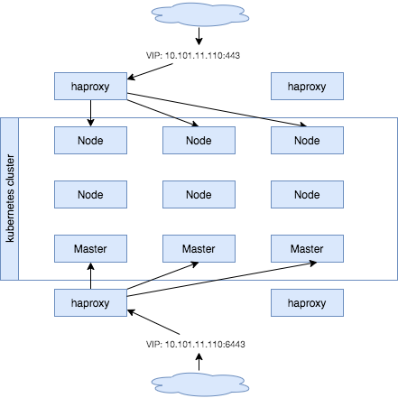
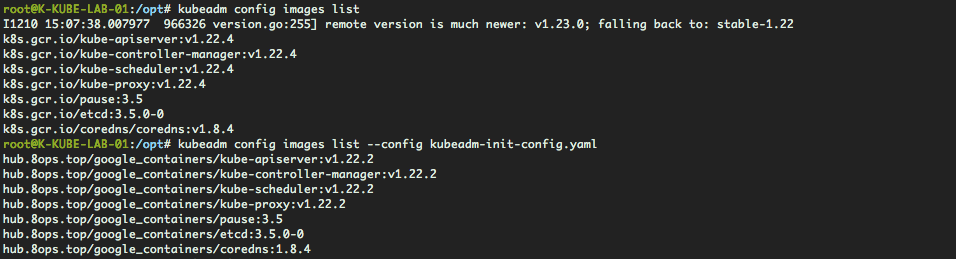
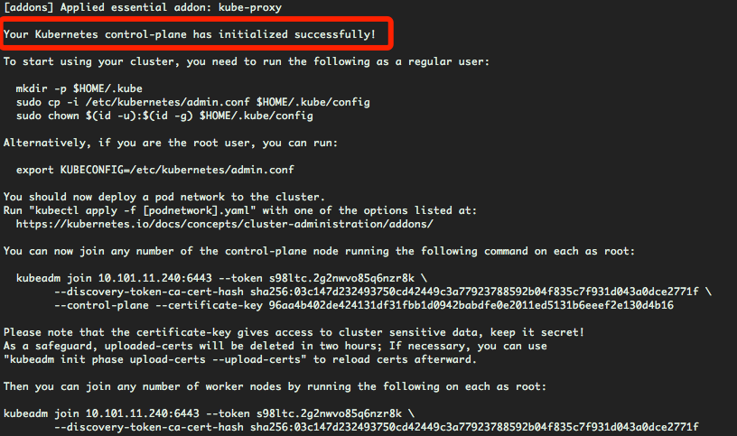
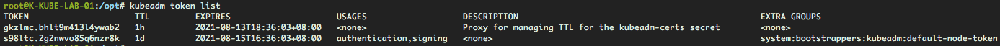
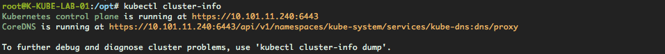
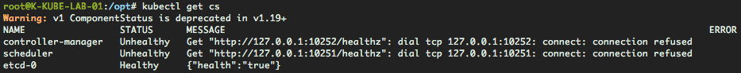
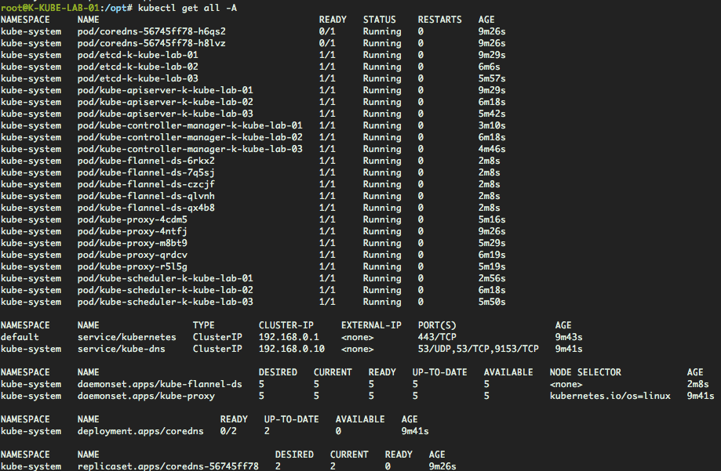
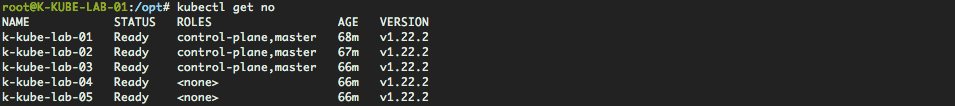
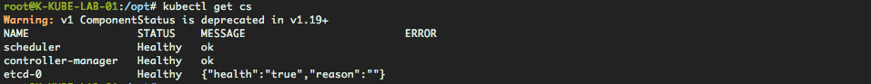
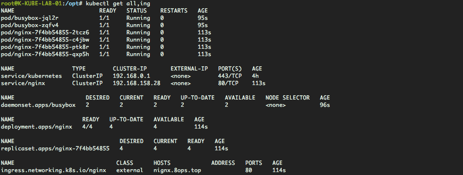

# Quick Start

`Kubernetes` 是一个开源的容器编排引擎，用来对容器化应用进行自动化部署、 扩缩和管理。

从 `CNCF` 毕业，`Kubernetes` 是当下最火热的技术各大中小互联网公司都在积极推进他的落地。


*接下来跟着我的笔记一步一步操作简单快速搭建 kubernetes cluster吧*。


## 一、背景描述

采用 **[kubeadm](https://kubernetes.io/zh/docs/setup/production-environment/tools/kubeadm/create-cluster-kubeadm/)** 方式安装


### 1.1 机器准备

VIP：`10.101.11.110`，用于解决apiserver的高可用均衡负载到 3 台 master 节点。

| 主机名称      | 主机IP        | 操作系统           | 角色分配             |
| ------------- | ------------- | ------------------ | -------------------- |
| K-KUBE-LAB-01 | 10.101.11.240 | Ubuntu 20.04.2 LTS | control-plane,master |
| K-KUBE-LAB-02 | 10.101.11.114 | Ubuntu 20.04.2 LTS | control-plane,master |
| K-KUBE-LAB-03 | 10.101.11.154 | Ubuntu 20.04.2 LTS | control-plane,master |
| K-KUBE-LAB-08 | 10.101.11.196 | Ubuntu 20.04.2 LTS | node                 |
| K-KUBE-LAB-11 | 10.101.11.157 | Ubuntu 20.04.2 LTS | node                 |
| K-KUBE-LAB-12 | 10.101.11.250 | Ubuntu 20.04.2 LTS | node                 |

机器参考官方最小配置指导，采用**2**核CPU/**8**G内存/**100**G磁盘，私有化虚拟机部署。


### 1.2 软件版本

> 匹配版本

| 软件名称   | 当前最新版本           |
| ---------- | ---------------------- |
| kubeadm    | 1.23.0-00              |
| kubelet    | 1.23.0-00              |
| kubernetes | 1.23.0-00              |
| etcd       | v3.5.1                 |
| flannel    | v0.15.1                |
| coredns    | 1.8.6                  |
| containerd | 1.5.5-0ubuntu3~20.04.2 |

> Reference

- [kubeadm](https://github.com/kubernetes/kubeadm)
- [kubernetes](https://github.com/kubernetes/kubernetes)
- [etcd](https://github.com/etcd-io/etcd) 
- [cni](https://github.com/containernetworking/cni)
- [containerd](https://github.com/containerd/containerd)
- [flannel](https://github.com/flannel-io/flanne)
- [coredns](https://github.com/coredns/coredns)
- [dashboard](https://github.com/kubernetes/dashboard)


### 1.3 部署架构

> 部署拓扑




> 部署套件

| 所属范畴          | 组件名称                 | 部署方式 | 运行方式   |
| ----------------- | ------------------------ | -------- | ---------- |
| 控制平面/Node节点 | kubelet                  | systemd  | binary     |
| 控制平面          | etcd                     | kubeadm  | static pod |
| 控制平面          | kube-apiserver           | kubeadm  | static pod |
| 控制平面          | kube-controller-manager  | kubeadm  | static pod |
| 控制平面          | kube-scheduler           | kubeadm  | static pod |
| 控制平面/Node节点 | kube-proxy               | kubeadm  | daemonset  |
| 控制平面/Node节点 | kube-flannel             | kubectl  | daemonset  |
| Node节点          | kube-coredns             | kubeadm  | deployment |
| Node节点          | kube-dahboard            | helm     | deployment |
| Node节点          | ingress-nginx-controller | helm     | deployment |
| Node节点          | prometheus               | helm     | deployment |
| Node节点          | alertmanager             | helm     | deployment |


### 1.4 环境说明

- 国内私有云网络环境
- 镜像提前下载到私有环境harbor（可以从阿里云镜像中转下载）[加速访问镜像](10-access-image.md)


## 二、前期准备

进行必要的操作让每个节点符合 kubernetes 安装的要求


### 2.1 一键优化

> 优化内容包括

1. 优化文件打开数
2. 关闭swap
3. 启动必要模块
4. 优化内核
5. 优化软件源
6. 安装必要软件
7. kubectl 的 bash 补全

```bash
curl -s https://books.8ops.top/attachment/kubernetes/bin/01-init.sh | bash
```


### 2.2 数据目录

> `/var/lib/containerd`

来源于配置文件 `/etc/containerd/config.toml`

`/var/lib/containerd` 需要指向到磁盘综合属性较好的位置

- 存储空间足够大
- IO读写性能较好

```bash
mkdir -p /data1/lib/containerd && \
    ([ -e /var/lib/containerd ] && mv /var/lib/containerd{,-$(date +%Y%m%d)} || /bin/true) && \
    ln -s /data1/lib/containerd /var/lib/containerd
ls -l /var/lib/containerd
```


> `/var/lib/kubelet`

```bash
mkdir -p /data1/lib/kubelet && \
    ([ -e /var/lib/kubelet ] && mv /var/lib/kubelet{,-$(date +%Y%m%d)} || /bin/true) && \
    ln -s /data1/lib/kubelet /var/lib/kubelet
ls -l /var/lib/kubelet		
```


> `/var/lib/etcd`

来源于配置文件`/etc/kubernetes/manifests/etcd.yaml`

```bash
mkdir -p /data1/lib/etcd && \
    ([ -e /var/lib/etcd ] && mv /var/lib/etcd{,-$(date +%Y%m%d)} || /bin/true) && \
    ln -s /data1/lib/etcd /var/lib/etcd
ls -l /var/lib/etcd
```


## 三、实施部署


### 3.1 容器运行时

**在所有节点需要执行的操作**


> 使用 containerd 做为容器运行时

```bash
# CONTAINERD_VERSION=1.5.5-0ubuntu3~20.04.2
CONTAINERD_VERSION=1.6.12-0ubuntu1~20.04.1
apt install -y containerd=${CONTAINERD_VERSION}

apt-mark hold containerd
apt-mark showhold
dpkg -l | grep containerd
```

Reference

- [容器运行时](https://kubernetes.io/zh/docs/setup/production-environment/container-runtimes/)


> 默认配置

```bash
# 替换 ctr 运行时
mkdir -p /etc/containerd
containerd config default > /etc/containerd/config.toml-default
cp /etc/containerd/config.toml-default /etc/containerd/config.toml

#
# Example 
#   https://books.8ops.top/attachment/kubernetes/containerd-config.toml
#

sed -i 's#sandbox_image.*$#sandbox_image = "hub.8ops.top/google_containers/pause:3.6"#' /etc/containerd/config.toml  
sed -i 's#SystemdCgroup = false#SystemdCgroup = true#' /etc/containerd/config.toml 
grep -P 'sandbox_image|SystemdCgroup' /etc/containerd/config.toml  
systemctl restart containerd
systemctl status containerd
```


> 受信私有 CA

```bash
#
# Example
#   https://books.8ops.top/attachment/kubernetes/containerd-config.toml
#

# 方式一，操作系统受信私有CA
apt install -y ca-certificates
cp CERTIFICATE.crt /usr/local/share/ca-certificates/CERTIFICATE.crt
update-ca-certificates

# 方式二，编辑/etc/containerd/config.toml
# 支持私有Harbor，当使用私有CA签名时需要系统受信根CA或者采用非安全模式见编辑config.toml
……

[plugins] # relative
	……
  [plugins."io.containerd.grpc.v1.cri"] # relative
 		……
 		# sandbox_image
    sandbox_image = "hub.8ops.top/google_containers/pause:3.6"
		……
      [plugins."io.containerd.grpc.v1.cri".containerd.runtimes]
        [plugins."io.containerd.grpc.v1.cri".containerd.runtimes.runc]
          [plugins."io.containerd.grpc.v1.cri".containerd.runtimes.runc.options]
            # systemd
            SystemdCgroup = true
		……
    # insecure
    [plugins."io.containerd.grpc.v1.cri".registry]
      [plugins."io.containerd.grpc.v1.cri".registry.mirrors] # relative
        [plugins."io.containerd.grpc.v1.cri".registry.mirrors."hub.8ops.top"]
          endpoint = ["https://hub.8ops.top"]
      [plugins."io.containerd.grpc.v1.cri".registry.configs] # relative
        [plugins."io.containerd.grpc.v1.cri".registry.configs."hub.8ops.top".tls]
          insecure_skip_verify = true  

# QuickStart Usage
sed -i '/.registry.mirrors/a \        [plugins."io.containerd.grpc.v1.cri".registry.mirrors."hub.8ops.top"]\n          endpoint = ["https://hub.8ops.top"]' /etc/containerd/config.toml
sed -i '/.registry.configs/a \         [plugins."io.containerd.grpc.v1.cri".registry.configs."hub.8ops.top".tls]\n          insecure_skip_verify = true ' /etc/containerd/config.toml
systemctl restart containerd
crictl pull hub.8ops.top/google_containers/pause:3.6
```


### 3.2 初始 kubeadm 环境

> Reference

- [InitConfiguration](https://pkg.go.dev/k8s.io/kubernetes/cmd/kubeadm/app/apis/kubeadm/v1beta2?utm_source=godoc#InitConfiguration)

- [ClusterConfiguration](https://pkg.go.dev/k8s.io/kubernetes/cmd/kubeadm/app/apis/kubeadm/v1beta2?utm_source=godoc#ClusterConfiguration)
- [KubeProxyConfiguration](https://pkg.go.dev/k8s.io/kube-proxy/config/v1alpha1?utm_source=godoc#KubeProxyConfiguration)
- [KubeletConfiguration](https://pkg.go.dev/k8s.io/kubelet/config/v1beta1?utm_source=godoc#KubeletConfiguration)


**在所有节点需要执行的操作**

> 安装kubeadm必要软件包

```bash
KUBERNETES_VERSION=1.23.0-00
apt install -y -q kubeadm=${KUBERNETES_VERSION} kubectl=${KUBERNETES_VERSION} kubelet=${KUBERNETES_VERSION}

apt-mark hold kubeadm kubectl kubelet
apt-mark showhold
dpkg -l | grep kube
```


> 完善 crictl 执行配置

```bash
# deprecated
cat > /etc/systemd/system/kubelet.service.d/0-containerd.conf <<EOF
[Service]
Environment="KUBELET_EXTRA_ARGS=--container-runtime=remote --runtime-request-timeout=15m --container-runtime-endpoint=unix:///run/containerd/containerd.sock"
EOF

# 用于运行crictl
cat > /etc/crictl.yaml <<EOF
runtime-endpoint: unix:///run/containerd/containerd.sock
image-endpoint: unix:///run/containerd/containerd.sock
timeout: 10
debug: false
EOF

systemctl restart containerd
crictl images
crictl ps -a

#
# 不配置指定时会默认依次按顺序使用：docker--> containerd --> cri-o，缺省默认使用docker
# 常见输出警告如下
# WARN[0000] image connect using default endpoints: [unix:///var/run/dockershim.sock unix:///run/containerd/containerd.sock unix:///run/crio/crio.sock]
#
# 若不存在容器运行时则报错如下
# FATA[0010] failed to connect: failed to connect: context deadline exceeded
#
```


### 3.3 初始化集群

**选择其中一台** *control-plane, master* 节点，这里选择 `10.101.11.240`

> 初始操作

```bash
# 默认配置
kubeadm config print init-defaults > kubeadm-init.yaml-default

#
# Example 
#   https://books.8ops.top/attachment/kubernetes/kubeadm-init.yaml-v1.23.0
#

# 默认镜像
kubeadm config images list -v 5

# 打印镜像
kubeadm config images list --config kubeadm-init.yaml -v 5

# 预取镜像
kubeadm config images pull --config kubeadm-init.yaml -v 5
```


> 编辑 kubeadm-init.yaml

```yaml
apiVersion: kubeadm.k8s.io/v1beta3
bootstrapTokens:
- groups:
  - system:bootstrappers:kubeadm:default-node-token
  ttl: 24h0m0s
  usages:
  - signing
  - authentication
kind: InitConfiguration
localAPIEndpoint:
  advertiseAddress: 10.101.11.240
  bindPort: 6443
nodeRegistration:
  criSocket: /run/containerd/containerd.sock
  name: K-KUBE-LAB-01
  taints: null
  kubeletExtraArgs: null
---
apiServer:
  timeoutForControlPlane: 4m0s
apiVersion: kubeadm.k8s.io/v1beta3
certificatesDir: /etc/kubernetes/pki
clusterName: kubernetes
controllerManager: {}
dns:
  imageRepository: hub.8ops.top/google_containers
  imageTag: 1.8.6
etcd:
  local:
    dataDir: /var/lib/etcd
imageRepository: hub.8ops.top/google_containers
kind: ClusterConfiguration
kubernetesVersion: 1.23.0
controlPlaneEndpoint: 10.101.11.110:6443
networking:
  dnsDomain: cluster.local
  podSubnet: 172.20.0.0/16
  serviceSubnet: 192.168.0.0/16
scheduler: {}
---
apiVersion: kubelet.config.k8s.io/v1beta1
kind: KubeletConfiguration
cgroupDriver: systemd
---
apiVersion: kubeproxy.config.k8s.io/v1alpha1
kind: KubeProxyConfiguration
```


> 演示效果




> 初始化集群

```bash
kubeadm init --config kubeadm-init.yaml --upload-certs -v 5
```


> 演示效果




> 配置缺省时 kubeconfig 文件

```bash
mkdir -p ~/.kube && ln -s /etc/kubernetes/admin.conf ~/.kube/config 
```


> 查看节点

```bash
kubectl get no
```


> 修改全局配置

kubelet 和 kube-proxy 需要相应重启

```bash
# kubeadm
kubectl -n kube-system edit cm kubeadm-config

# kubelet

kubectl -n kube-system edit cm kubelet-config-1.23
……
		# GC
    imageGCLowThresholdPercent: 40
    imageGCHighThresholdPercent: 50
    # Resource
    systemReserved:
      cpu: 500m
      memory: 500m
    kubeReserved:
      cpu: 500m
      memory: 500m
    evictionPressureTransitionPeriod: 300s # upgrade
    nodeStatusReportFrequency: 10s         # upgrade
    nodeStatusUpdateFrequency: 10s         # upgrade
    cgroupDriver: systemd
    maxPods: 200
    resolvConf: /etc/resolv.conf
kind: ConfigMap                            # relative
……

# kube-proxy 
# 当flannel采用host-gw时，需要开启ipvs
kubectl -n kube-system edit cm kube-proxy

……
    configSyncPeriod: 5s # upgrade
    mode: "ipvs"         # upgrade
    ipvs:                # relative
      tcpTimeout: 900s   # upgrade
      syncPeriod: 5s     # upgrade
      minSyncPeriod: 5s  # upgrade
……

```

> 自举Pod's QoS

```bash
# kube-proxy
kubectl -n kube-system edit daemonset kube-proxy
……
    resources:
      requests:
        cpu: 100m
        memory: 128Mi
……

# coredns
kubectl -n kube-system edit deployment coredns
……
    resources:
      requests:
        cpu: 50m
        memory: 64Mi
……

# kube-flannel-ds
kubectl -n kube-system edit daemonset kube-flannel-ds
……
    resources:
      requests:
        cpu: 50m
        memory: 64Mi
……

# kube-apiserver - [Burstable]
# kube-controller-manager - [Burstable]
# kube-scheduler - [Burstable]
```


### 3.4 Join 节点

获取Join信息


**方式一**，在初始完集群会打印Join的命令

在初始化集群成功时输出的信息中有打印出来，参考上面Output内容


**方式二**，构建Join命令

> **上传certs**

```bash
# 上传 cert
kubeadm init phase upload-certs --upload-certs

#
## 或者获取已经上传的certs
# openssl x509 -pubkey -in /etc/kubernetes/pki/ca.crt | \
#    openssl rsa -pubin -outform der 2>/dev/null | \
#    openssl dgst -sha256 -hex | sed 's/^.* //'
#

# 生成 token
kubeadm token generate

# 打印 join control-plane,master
kubeadm token create um69xx.qg70e11b92fmsevs --print-join-command -v 5 \
  --certificate-key 3c7b6191702471e8ee2f3dea4ce422044b266928c808b6957fb0c81ef2388bed

# 打印 join node
kubeadm token create kvj7wh.buud7djga5j76xil --print-join-command -v 5

# ---
# 一步就位

# join control-plane
kubeadm token create --print-join-command --certificate-key xx

# join node
kubeadm token create --print-join-command 

```


> 查看 token list

```bash
kubeadm token list
```




> join control-plane,master

```bash
kubeadm join 10.101.11.110:6443 --token abcdef.0123456789abcdef \
 --discovery-token-ca-cert-hash sha256:ae1d593bbadecf245c30f4c1cfe9250faa0aaa9e4c27b7f34bcb10142d0dd0c8 \
 --control-plane --certificate-key 811e33703005a1df116201ae6469d86746274c3579e62b7c924cc4c13a804bca -v 5in the cluster.
```


> join node

```bash
kubeadm join 10.101.11.110:6443 --token abcdef.0123456789abcdef \
  --discovery-token-ca-cert-hash sha256:ae1d593bbadecf245c30f4c1cfe9250faa0aaa9e4c27b7f34bcb10142d0dd0c8
```


### 3.5 部署网络

此外选型`flannel`

> 部署

```bash
#
# Reference 
#   https://raw.githubusercontent.com/flannel-io/flannel/master/Documentation/kube-flannel.yml
#
# Example
#   https://books.8ops.top/attachment/kubernetes/kube-flannel.yaml-v0.15.1
#

kubectl apply -f kube-flannel.yaml
```


> 编辑 kube-flannel.yaml

```yaml
……
  net-conf.json: | # relative
    {
      "Network": "172.20.0.0/16",
      "Backend": {
        "Type": "host-gw"
      }
    }
……
	# 镜像替换为私有地址
      initContainers:
      - name: install-cni-plugin
        image: hub.8ops.top/google_containers/flannel-cni-plugin:v1.0.0
        ……
      - name: install-cni
        image: hub.8ops.top/google_containers/flannel:v0.15.1
        ……
      containers:
      - name: kube-flannel
        image: hub.8ops.top/google_containers/flannel:v0.15.1
```


### 3.6 验收集群

> 查看cluster-info

```bash
kubectl cluster-info
```



OR

```bash
kubectl get cs
```




><optional> etcd运行信息

```bash
# download etcdctl
ETCDCTL_VERSION=v3.4.20
curl -sL -o \
  https://github.com/etcd-io/etcd/releases/download/${ETCDCTL_VERSION}/etcd-${ETCDCTL_VERSION}-linux-amd64.tar.gz
tar xzf etcd-${ETCDCTL_VERSION}-linux-amd64.tar.gz
cp etcd-${ETCDCTL_VERSION}-linux-amd64/etcdctl ~/bin/etcdctl

etcdctl member list \
	--endpoints=https://10.101.11.240:2379 \
	--cacert=/etc/kubernetes/pki/etcd/ca.crt \
	--cert=/etc/kubernetes/pki/etcd/server.crt \
	--key=/etc/kubernetes/pki/etcd/server.key
	
etcdctl endpoint status \
	--endpoints=https://10.101.11.240:2379,https://10.101.11.114:2379,https://10.101.11.154:2379 \
	--cacert=/etc/kubernetes/pki/etcd/ca.crt \
	--cert=/etc/kubernetes/pki/etcd/server.crt \
	--key=/etc/kubernetes/pki/etcd/server.key

etcdctl endpoint status \
	--cluster \
	--cacert=/etc/kubernetes/pki/etcd/ca.crt \
	--cert=/etc/kubernetes/pki/etcd/server.crt \
	--key=/etc/kubernetes/pki/etcd/server.key

```


> 查看初始静态应用

```bash
kubectl get all -A
```




> 查看节点

```bash
kubectl get no
```




> 查看节点路由

```bash
apt install -y ipvsadm

ipvsadm -ln
```


## 四、常见问题

[获取工具kubectl](https://kubernetes.io/docs/tasks/tools/)

### 4.1 节点未就位

缺少集群网络或集群网络存在问题


### 4.2 coredns 未就位

第一种，安装插件时机

```bash
# 偶尔出现 coredns 不就位情况是因为加 Node 之前装网络插件 flannel 
kubectl get pod -A -o wide

# 亦或 coredns 在 control plane 节点上
# 重置后重新初始化集群，先安装 flannel，再 Join 其他节点
# 可以解决此现象
```


第二种，权限问题需要手动修复（ v1.22.0后已经修复）

```bash
~ # kubectl edit clusterrole system:coredns
……
# append
- apiGroups:
  - discovery.k8s.io
  resources:
  - endpointslices
  verbs:
  - list
  - watch
```

删除原有 pod/coredns-xx

```bash
kubectl -n kube-system delete pod/coredns-55866688ff-hwp4m pod/coredns-55866688ff-tn8sj
```


### 4.3 controller-manager 和scheduler 未健康就位

修复此问题

```bash
sed -i '/--port/d' /etc/kubernetes/manifests/kube-controller-manager.yaml
sed -i '/--port/d' /etc/kubernetes/manifests/kube-scheduler.yaml
```

即时自动生效




### 4.4 dns 寻址失败

```bash
#
# 方式一，启动busybox
## 建议使用1.28.0，新版本会有nslookup的BUG
# 
kubectl run busybox --image hub.8ops.top/third/busybox:1.28.0 --command -- sh -c "while true;do sleep 60;date;done"

# kubectl apply -f https://books.8ops.top/attachment/kubernetes/app/51-busybox-daemonset.yaml
kubectl run nginx --image hub.8ops.top/third/nginx:1.21.3

#
# 方式二，启动jessie-dnsutils:1.3
## 自带dns检测工具
```




### 4.5 容器运行失败

```bash
# 
# Case by case 看报什么错
# e.g. kubectl apply -f https://books.8ops.top/attachment/kubernetes/app/51-nginx-deployment.yaml
#

# 
# Example
#   https://books.8ops.top/attachment/kubernetes/app/50-busybox-daemonset.yaml
#   https://books.8ops.top/attachment/kubernetes/app/51-nginx-deployment.yaml
#   https://books.8ops.top/attachment/kubernetes/app/52-echoserver.yaml
#
```


<hr />

至此 kubernetes cluster 搭建完成了。

