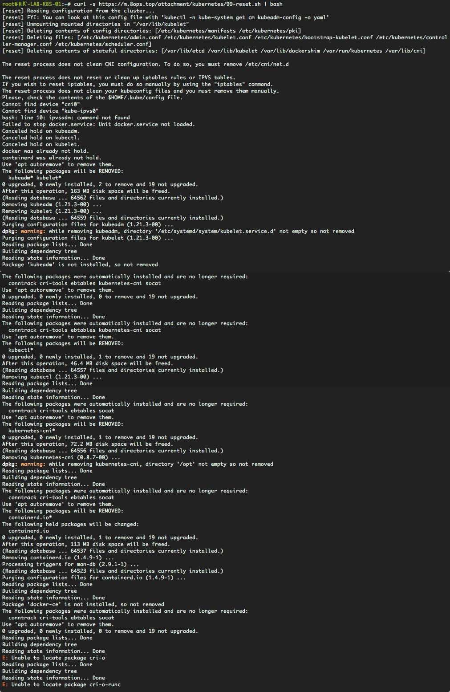

# 实战 | Kubernetes Cluster 快速重置

在搭建kubernetes cluster时很多时候需要快速重置一个节点，避免第二次搭建或重新将节点加入集群时被干扰，故整理了一键重置操作方便快速复用。


*已经封装一键脚本，下载直接执行*

## 一、快速应用

> 清除内容包括

1. reset kubernetes cluster 
2. release network
3. release fireward
4. stop service
5. remove package
6. release directory or files

```bash
curl -s https://books.8ops.top/attachment/kubernetes/bin/99-reset.sh | bash
```


> 演示效果




## 二、逻辑解析

> 设计原理

在kubernetes cluster搭建过程中会产生很多的虚拟网卡，安装相应的软件包在ubuntu操作系统中。

为达到彻底重置一个节点，让他回到最初的无污染操作系统状态。

充分应用了ubuntu操作系统特性对网络模块、软件包模块及服务模块的管理环节。


> 脚本内容

```Bash
#!/bin/bash

# set -ex

# 1, reset kubernetes cluster 
printf '\n\n1, reset kubernetes cluster\n'
command -v kubeadm && kubeadm reset --force --cri-socket /run/containerd/containerd.sock
# kubeadm reset --force --cri-socket /var/run/dockershim.sock

# 2, release network
printf '\n\n2, release network\n'
ip link set dev flannel.1 down || /bin/true
ip link set dev cni0 down || /bin/true
ip link set dev kube-ipvs0 down || /bin/true
ip link delete flannel.1 || /bin/true
ip link delete cni0 || /bin/true
ip link delete kube-ipvs0 || /bin/true

# show network device
printf '\n\n ---- show network device ---- \n'
# ip link show
ip address show
printf '  \n ----------------------------- \n\n'

# 3, release fireward
printf '\n\n3, release fireward\n'
iptables -F && iptables -X && ipvsadm -C
iptables -t nat -F && iptables -t nat -X
iptables -t mangle -F && iptables -t mangle -X

# show iptables
printf '\n\n ---- show iptables ---- \n'
iptables -t filter -vnxL
iptables -t filter -vnxL
ipvsadm -ln
printf '  \n ----------------------- \n\n'

# crictl images | awk 'NR>1{printf("crictl rmi %s\n",$3)}' |sh

# 4, stop services
printf '\n\n4, stop services\n'
systemctl stop kubelet
systemctl stop docker
systemctl stop containerd

# 5, remove packages
printf '\n\n6, remove packages\n'

# unhold packages
printf '\n\n5, unhold packages\n'
apt-mark unhold kubeadm
apt-mark unhold kubectl
apt-mark unhold kubelet
apt-mark unhold docker
apt-mark unhold containerd

# apt-mark showhold
printf '\n\n ---- apt-mark showhold ---- \n'
apt-mark showhold
printf '  \n --------------------------- \n\n'

# remove held packages
apt remove -y --purge --allow-change-held-packages kubeadm  || /bin/true
apt remove -y --purge --allow-change-held-packages kubelet || /bin/true
apt remove -y --purge --allow-change-held-packages kubectl  || /bin/true
apt remove -y --purge --allow-change-held-packages kubernetes-cni || /bin/true
apt remove -y --purge --allow-change-held-packages containerd  || /bin/true
apt remove -y --purge --allow-change-held-packages containerd.io  || /bin/true # deprecated
apt remove -y --purge --allow-change-held-packages docker-ce  || /bin/true.    # deprecated
apt remove -y --purge --allow-change-held-packages cri-o  || /bin/true
apt remove -y --purge --allow-change-held-packages cri-o-runc || /bin/true

# release auto-remove
apt auto-remove -y

# show release packages detail
printf '\n\n ---- show release packages detail ---- \n'
dpkg -l | awk '$2~/kube|cni|cri|containerd|docker/'
printf '  \n -------------------------------------- \n\n'

# 6, release directory or files
printf '\n\n7, release directory or files\n'
mv /data1/lib{,-$(date +%Y%m%d)}
rm -rf /etc/systemd/system/kubelet.service.d /var/lib/kubelet
rm -rf /var/lib/docker /etc/docker /run/docker /run/docker.sock /run/dockershim.sock
rm -rf /opt/containerd /etc/containerd /run/containerd /var/lib/containerd
rm -rf /etc/crio/ /etc/crictl.yaml
rm -rf /opt/cni /etc/cni /var/lib/cni /run/flannel
rm -rf ~/.kube /etc/kubernetes
rm -rf ~/.cache/helm ~/.config/helm


printf '\n\n ---- Completed ---- \n\n'
exit 0
```

