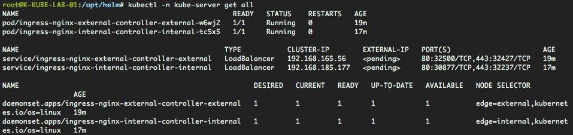
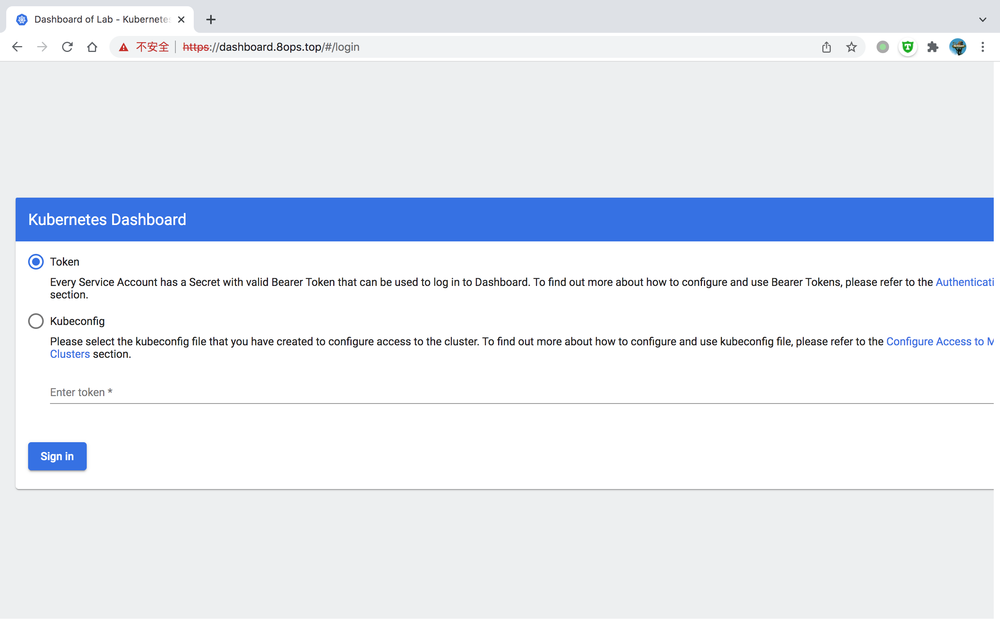
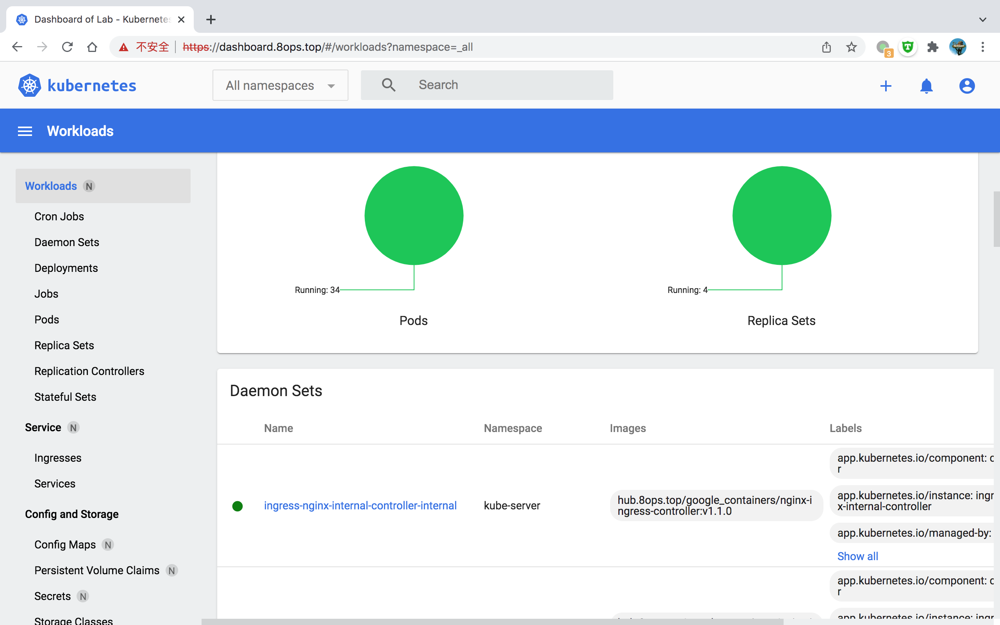

# Helm

Helm 是 Kubernetes 的包管理器，从CNCF毕业。

使用Helm安装Kubernetes中的插件将会变得是一件容易的事情。

> Reference

- [docs](https://helm.sh/zh/docs/)

- [hub](https://artifacthub.io/ ) 


Helm是个很意思的工具，简化了kubernetes上常用组件的管理。

使用Helm后会生成相应的缓存文件，使用过程中必要时可以主动清空。目录如下

- ~/.config/helm
- ~/.cache/helm

> 常用源

```bash
# helm repo list
NAME                               URL
azure                 https://mirror.azure.cn/kubernetes/charts
aliyun                https://kubernetes.oss-cn-hangzhou.aliyuncs.com/charts
elastic               https://helm.elastic.co
gitlab                https://charts.gitlab.io
harbor                https://helm.goharbor.io
bitnami               https://charts.bitnami.com/bitnami
incubator             https://kubernetes-charts-incubator.storage.googleapis.com
google                https://kubernetes-charts.storage.googleapis.com
ingress-nginx         https://kubernetes.github.io/ingress-nginx
kubernetes-dashboard  https://kubernetes.github.io/dashboard/
```

可以使用`azure`和`aliyun`

推荐配置系统网络代理

```bash
export https_proxy=http://127.0.0.1:7890 http_proxy=http://127.0.0.1:7890 all_proxy=socks5://127.0.0.1:7890
```

## 一、Ingress-nginx

> 宿主机kernel优化

```bash
sysctl -w net.core.somaxconn=32768; sysctl -w net.ipv4.ip_local_port_range='1024 65000'
```

```bash
helm repo add ingress-nginx https://kubernetes.github.io/ingress-nginx
helm repo update ingress-nginx

helm search repo ingress-nginx

helm show values ingress-nginx/ingress-nginx \
  --version 4.2.5 > ingress-nginx.yaml-4.2.5-default

# Example
#   https://books.8ops.top/attachment/kubernetes/helm/ingress-nginx-external.yaml-v4.2.5
#

# deprecated
# 若不FW需要变更 ~/.cache/helm/repository/ingress-nginx-index.yaml 从私有文件站下载
## sed -i 's#https://github.com/kubernetes/ingress-nginx/releases/download/helm-chart-4.0.13/ingress-nginx-4.0.13.tgz#http://d.8ops.top/ops/helm/ingress-nginx-4.0.13.tgz#' ~/.cache/helm/repository/ingress-nginx-index.yaml

# deprecated
# 使用metallb后就无须label在节点上
# kubectl label no k-kube-lab-11 edge=external
# kubectl cordon k-kube-lab-11 

helm install ingress-nginx-external-controller \
  ingress-nginx/ingress-nginx \
  -f ingress-nginx-external.yaml-4.2.5 \
  -n kube-server \
  --create-namespace \
  --version 4.2.5 --debug

helm list -A

# upgrade
helm upgrade --install ingress-nginx-external-controller \
  ingress-nginx/ingress-nginx \
  -f ingress-nginx-external.yaml \
  -n kube-server \
  --version 4.2.5 --debug

# uninstall     
helm -n kube-server uninstall ingress-nginx-external-controller
```

> ingress-nginx-external.yaml

```yaml
controller:
  name: external
  image:
    registry: hub.8ops.top
    image: google_containers/nginx-ingress-controller
    tag: "v1.1.0"
    digest:

  hostNetwork: true
  hostPort:
    enabled: true
    ports:
      http: 80
      https: 443

  config: {} # nginx.conf 全局配置

  ingressClassResource:
    name: external
    enabled: true
    default: false
    controllerValue: "k8s.io/ingress-nginx" # 这里的nginx是缺省的ingress-class

  resources:
    limits:
      cpu: 500m
      memory: 1Gi
    requests:
      cpu: 200m
      memory: 256Mi

  kind: DaemonSet
  nodeSelector:
    kubernetes.io/os: linux
    edge: external

  service:
    enabled: false

  lifecycle:
  admissionWebhooks:
    enabled: false
```

> 演示效果



> 切割日志

```bash
# 确保uid=101,gid=82的用户和组存在
groupadd -g 82 nginx-ingress
cd /data1/log/nginx

chown 101.82 * && ls -l 

systemctl start logrotate && ls -l && sleep 5 && systemctl status logrotate

# 调整定时器为小时
sed -i 's/OnCalendar=daily/OnCalendar=hourly/' /lib/systemd/system/logrotate.timer
systemctl daemon-reload && sleep 5 && systemctl status logrotate.timer

```

```bash
# /etc/logrotate.d/nginx
/var/log/nginx/access.log
 {
    su systemd-resolve nginx-ingress
    hourly
    rotate 180
    dateext
    missingok
    notifempty
    compress
    delaycompress
    nomail
    sharedscripts
    postrotate
        for pid in `/bin/pidof nginx `;do
            kill -USR1 ${pid}
        done
    endscript
}
/var/log/nginx/error.log
 {
    su systemd-resolve nginx-ingress
    daily
    rotate 7
    dateext
    missingok
    notifempty
    compress
    delaycompress
    nomail
    sharedscripts
    postrotate
        for pid in `/bin/pidof nginx `;do
            kill -USR1 ${pid}
        done
    endscript
}
```

## 二、Dashboard

```bash
helm repo add kubernetes-dashboard https://kubernetes.github.io/dashboard/
helm repo update kubernetes-dashboard

helm search repo kubernetes-dashboard

helm show values kubernetes-dashboard/kubernetes-dashboard \
  --version 5.10.0  > kubernetes-dashboard.yaml-5.10.0-default

# vim kubernetes-dashboard.yaml

# deprecated
# 若不FW需要变更 ~/.cache/helm/repository/kubernetes-dashboard-index.yaml 从私有文件站下载
## sed -i 's#kubernetes-dashboard-5.0.4.tgz#http://d.8ops.top/ops/helm/kubernetes-dashboard-5.0.4.tgz#' ~/.cache/helm/repository/kubernetes-dashboard-index.yaml

helm install kubernetes-dashboard \
  kubernetes-dashboard/kubernetes-dashboard \
  -f kubernetes-dashboard.yaml-v5.10.0 \
  -n kube-server \
  --create-namespace \
  --version 5.10.0 --debug

helm upgrade --install kubernetes-dashboard \
  kubernetes-dashboard/kubernetes-dashboard \
  -f kubernetes-dashboard.yaml \
  -n kube-server \
  --version 5.10.0 --debug

#-----------------------------------------------------------
# create sa for guest
kubectl create serviceaccount dashboard-guest -n kube-server

# binding clusterrole
kubectl create clusterrolebinding dashboard-guest \
  --clusterrole=view \
  --serviceaccount=kube-server:dashboard-guest

# output token #1
kubectl describe secrets \
  -n kube-server $(kubectl -n kube-server get secret | awk '/dashboard-guest/{print $1}')

# output token #2
kubectl -n kube-server get secret \
  `kubectl -n kube-server get sa dashboard-guest -o jsonpath={.secrets[0].name}` \
  -o jsonpath={.data.token} | base64 --decode; echo
  
#-----------------------------
# create sa for ops
kubectl create serviceaccount dashboard-ops -n kube-server

# binding clusterrole
kubectl create clusterrolebinding dashboard-ops \
  --clusterrole=cluster-admin \
  --serviceaccount=kube-server:dashboard-ops

# create token （从 kubernetes v1.24.0+ 开始需要手动创建secrets）
kubectl apply -f - <<EOF
apiVersion: v1
kind: Secret
metadata:
  name: dashboard-ops-secret
  namespace: kube-server
  annotations:
    kubernetes.io/service-account.name: dashboard-ops
type: kubernetes.io/service-account-token
EOF

# output token
kubectl describe secrets dashboard-ops-secret # v1.24.0+
kubectl describe secrets \
  -n kube-server $(kubectl -n kube-server get secret | awk '/dashboard-ops/{print $1}')
```

Reference

- [kubeconfig](504-app-kubeconfig.md)


> vim kubernetes-dashboard.yaml

```yaml
image:
  repository: hub.8ops.top/google_containers/dashboard
  tag: v2.4.0

resources:
  requests:
    cpu: 200m
    memory: 256Mi
  limits:
    cpu: 1
    memory: 512Mi

ingress:
  enabled: true
  annotations:
    nginx.ingress.kubernetes.io/backend-protocol: "HTTPS"

  className: "external"

  hosts:
    - dashboard.8ops.top
  tls:
    - secretName: tls-8ops.top
      hosts:
        - dashboard.8ops.top

extraArgs: 
  - --token-ttl=86400

settings:
  clusterName: "Dashboard of Lab"
  itemsPerPage: 20
  labelsLimit: 3
  logsAutoRefreshTimeInterval: 10
  resourceAutoRefreshTimeInterval: 10

metricsScraper:
  enabled: true
  image:
    repository: hub.8ops.top/google_containers/metrics-scraper
    tag: v1.0.7
  resources:
    requests:
      cpu: 100m
      memory: 128Mi
    limits:
      cpu: 100m
      memory: 128Mi

metrics-server:
  enabled: true
  image:
    repository: hub.8ops.top/google_containers/metrics-server
    tag: v0.5.0
  resources:
    requests:
      cpu: 100m
      memory: 128Mi
    limits:
      cpu: 100m
      memory: 128Mi
  args:
    - --kubelet-preferred-address-types=InternalIP
    - --kubelet-insecure-tls

```

> 演示效果





## 三、Elastic

```bash
helm repo add elastic https://helm.elastic.co
helm repo update elastic

# logstash
helm search repo logstash
helm show values elastic/logstash \
  --version 7.17.3 > elastic_logstash.yaml-7.17.3-default

helm install logstash elastic/logstash \
  -f elastic_logstash.yaml-7.17.3 \
  -n kube-server \
  --create-namespace \
  --version 7.17.3 --debug

helm upgrade logstash elastic/logstash \
  -f elastic_logstash.yaml-7.17.3 \
  -n kube-server \
  --version 7.17.3 --debug

# elastic [failure]
helm search repo elastic
helm show values elastic/elasticsearch \
  --version 7.17.3 > elasticsearch.yaml-7.17.3-default

helm install elasticsearch-ops elastic/elasticsearch \
  -f elasticsearch.yaml-7.17.3 \
  -n kube-server \
  --create-namespace \
  --version 7.17.3 --debug

helm -n kube-server uninstall elasticsearch-ops        

# elastic_eck
helm show values elastic/eck-operator \
  --version 1.9.1 > elastic_eck.yaml-1.9.1-default

helm install elastic-operator elastic/eck-operator \
  -f elastic_eck.yaml-1.9.1 \
  -n kube-server \
  --create-namespace \
  --version 1.9.1 --debug

helm upgrade --install elastic-operator elastic/eck-operator \
  -f elastic_eck.yaml-1.9.1 \
  -n kube-server \
  --create-namespace \
  --version 1.9.1 --debug

# origin
kubectl create -f https://download.elastic.co/downloads/eck/1.9.1/crds.yaml
kubectl apply -f https://download.elastic.co/downloads/eck/1.9.1/operator.yaml

kubectl -n elastic-system logs -f statefulset.apps/elastic-operator
```

## 四、Prometheus

```bash
helm repo add prometheus-community https://prometheus-community.github.io/helm-charts
helm repo update prometheus-community
helm search repo prometheus

# prometheus
helm show values prometheus-community/prometheus \
  --version 15.8.0 > prometheus.yaml-15.8.0-default

helm upgrade --install prometheus prometheus-community/prometheus \
  -f prometheus.yaml-15.8.0 \
  -n kube-server \
  --create-namespace \
  --version 15.8.0 --debug
```


## 五、Cert-Manager

[Reference](https://cert-manager.io/docs/configuration/ca/)

```bash
helm repo add jetstack https://charts.jetstack.io
helm repo update jetstack
helm search repo cert-manager

# cert-manager
helm show values jetstack/cert-manager --version=v1.11.0 > cert-manager.yaml-v1.11.0-default

# Example 
#   https://books.8ops.top/attachment/cert-manager/helm/cert-manager.yaml-v1.9.1
#   https://books.8ops.top/attachment/cert-manager/helm/cert-manager.yaml-v1.11.0
#   

helm upgrade --install cert-manager jetstack/cert-manager \
  -f cert-manager.yaml-v1.9.1 \
  -n cert-manager \
  --create-namespace \
  --version v1.9.1 --debug
    
helm upgrade --install cert-manager jetstack/cert-manager \
  -f cert-manager.yaml-v1.11.0 \
  -n cert-manager \
  --create-namespace \
  --version v1.11.0 --debug

#  --set 'extraArgs={--dns01-recursive-nameservers-only,--dns01-recursive-nameservers=119.29.29.29:53\,114.114.114.114:53}' \

helm -n cert-manager uninstall cert-manager
```


### 5.1 私有CA签发

```bash
# Example
# https://books.8ops.top/attachment/cert-manager/clusterissuer-private.yaml
# https://books.8ops.top/attachment/cert-manager/certificate-private.yaml
# https://books.8ops.top/attachment/cert-manager/ingress-private.yaml
#

# 1. ROOT CA
kubectl -n cert-manager create secret generic ca-key-pair \
  --from-file=tls.crt=xx.crt \
  --from-file=tls.key=xx.key

# 2. ClusterIssuer 可切换成 Issuer
kubectl apply -f - << EOF
apiVersion: cert-manager.io/v1
kind: ClusterIssuer
metadata:
  name: ca-cluster-issuer
  namespace: cert-manager
spec:
  ca:
    secretName: ca-key-pair
    crlDistributionPoints: # 域名证书吊销列表
    - "http://example.com"
EOF

# 3. Ingress
kubectl apply -f - << EOF
apiVersion: networking.k8s.io/v1
kind: Ingress
metadata:
  annotations:
    cert-manager.io/cluster-issuer: ca-cluster-issuer # 自动签发注解
  labels:
    app: ingress-private
  name: ingress-private
  namespace: default
spec:
  ingressClassName: external
  rules:
  - host: echoserver.abc.org
    http:
      paths:
      - backend:
          service:
            name: echoserver
            port:
              number: 8080
        path: /
        pathType: Prefix
  tls:
  - hosts:
    - www.abc.org
    - echoserver.abc.org
    - "*.abc.org"
    secretName: tls-abc.org # 自动生成 secret 名称
EOF    

# 4. view
~$ kubectl get ing,secret
NAME                                        CLASS      HOSTS                 ADDRESS         PORTS     AGE
ingress.networking.k8s.io/ingress-private   external   echoserver.abc.org    10.101.11.216   80, 443   8m13s

NAME                  TYPE                DATA   AGE
secret/tls-abc.org    kubernetes.io/tls   3      7m10s
```


### 5.2 LetsEncrypt

> 实测效果

| 顶级域名 | 成功与否 |
| -------- | -------- |
| *.top    | x        |
| *.cn     | √        |
| *.tech   | √        |
| *.com    | √        |

[Reference](https://cert-manager.io/docs/configuration/acme/dns01/#webhook)

cert-manager also supports out of tree DNS providers using an external webhook. Links to these supported providers along with their documentation are below:

- [`AliDNS-Webhook`](https://github.com/pragkent/alidns-webhook)
- [`cert-manager-alidns-webhook`](https://github.com/DEVmachine-fr/cert-manager-alidns-webhook)
- [`cert-manager-webhook-civo`](https://github.com/okteto/cert-manager-webhook-civo)
- [`cert-manager-webhook-dnspod`](https://github.com/qqshfox/cert-manager-webhook-dnspod)
- [`cert-manager-webhook-dnsimple`](https://github.com/neoskop/cert-manager-webhook-dnsimple)
- [`cert-manager-webhook-gandi`](https://github.com/bwolf/cert-manager-webhook-gandi)
- [`cert-manager-webhook-infomaniak`](https://github.com/Infomaniak/cert-manager-webhook-infomaniak)
- [`cert-manager-webhook-inwx`](https://gitlab.com/smueller18/cert-manager-webhook-inwx)
- [`cert-manager-webhook-linode`](https://github.com/slicen/cert-manager-webhook-linode)
- [`cert-manager-webhook-oci`](https://gitlab.com/dn13/cert-manager-webhook-oci) (Oracle Cloud Infrastructure)
- [`cert-manager-webhook-scaleway`](https://github.com/scaleway/cert-manager-webhook-scaleway)
- [`cert-manager-webhook-selectel`](https://github.com/selectel/cert-manager-webhook-selectel)
- [`cert-manager-webhook-softlayer`](https://github.com/cgroschupp/cert-manager-webhook-softlayer)
- [`cert-manager-webhook-ibmcis`](https://github.com/jb-dk/cert-manager-webhook-ibmcis)
- [`cert-manager-webhook-loopia`](https://github.com/Identitry/cert-manager-webhook-loopia)
- [`cert-manager-webhook-arvan`](https://github.com/kiandigital/cert-manager-webhook-arvan)
- [`bizflycloud-certmanager-dns-webhook`](https://github.com/bizflycloud/bizflycloud-certmanager-dns-webhook)
- [`cert-manager-webhook-hetzner`](https://github.com/vadimkim/cert-manager-webhook-hetzner)
- [`cert-manager-webhook-yandex-cloud`](https://github.com/malinink/cert-manager-webhook-yandex-cloud)
- [`cert-manager-webhook-netcup`](https://github.com/aellwein/cert-manager-webhook-netcup)
- [`cert-manager-webhook-pdns`](https://github.com/zachomedia/cert-manager-webhook-pdns)

#### 5.2.1 imroc

```bash
# cert-manager-webhook-dnspod
helm repo add imroc https://charts.imroc.cc
helm repo update imroc
helm search repo cert-manager-webhook-dnspod

helm show values imroc/cert-manager-webhook-dnspod --version=1.2.0 > cert-manager-webhook-dnspod-imroc.yaml-1.2.0-default

# Example 
#   https://books.8ops.top/attachment/cert-manager/helm/cert-manager-webhook-dnspod-imroc.yaml-1.2.0
#   https://books.8ops.top/attachment/cert-manager/certificate-dnspod-imroc.yaml
#   https://books.8ops.top/attachment/cert-manager/ingress-dnspod-imroc.yaml
#   

helm upgrade --install cert-manager-webhook-dnspod-imroc imroc/cert-manager-webhook-dnspod \
    -f cert-manager-webhook-dnspod-imroc.yaml-1.2.0 \
    -n cert-manager \
    --create-namespace \
    --version 1.2.0 --debug

# uninstall
helm -n cert-manager uninstall cert-manager-webhook-dnspod-imroc

kubectl -n cert-manager delete \
    secret/cert-manager-webhook-dnspod-ca \
    secret/cert-manager-webhook-dnspod-letsencrypt \
    secret/cert-manager-webhook-dnspod-webhook-tls

# view
kubectl -n cert-manager get \
    all,ing,cm,secret,issuer,clusterissuer,certificate,CertificateRequest,cert-manager

kubectl -n default get \
    ingress,secret,issuer,clusterissuer,certificate,CertificateRequest,cert-manager

# 自动生成
# kubectl apply -f certificate-dnspod-imroc.yaml

# Ingress 中 secret 签发
kubectl apply -f ingress-dnspod-imroc.yaml
```


#### 5.2.2 qqshfox

[Reference](https://github.com/qqshfox/cert-manager-webhook-dnspod)

```bash
git clone https://github.com/qqshfox/cert-manager-webhook-dnspod.git abc
mv abc/deploy/cert-manager-webhook-dnspod  cert-manager-webhook-dnspod

# Example 
#   https://books.8ops.top/attachment/cert-manager/helm/cert-manager-webhook-dnspod-qqshfox.yaml
#   # 用于单独测试生成签名证书
#   https://books.8ops.top/attachment/cert-manager/certificate-dnspod-qqshfox.yaml 
#   https://books.8ops.top/attachment/cert-manager/ingress-dnspod-qqshfox.yaml
#

helm upgrade --install cert-manager-webhook-dnspod-qqshfox ./cert-manager-webhook-dnspod-qqshfox \
    --namespace cert-manager \
    -f cert-manager-webhook-dnspod-qqshfox.yaml \
    --debug

# 自动生成
# kubectl apply -f certificate-dnspod-qqshfox.yaml

# Ingress 中 secret 签发
kubectl apply -f ingress-dnspod-qqshfox.yaml

# uninstall
helm -n cert-manager uninstall cert-manager-webhook-dnspod-qqshfox

# 注意
# 当集群中有两个 dnspod webhook 时
# 两个 webhook 的 groupName 不能相同
# 但 certificate 必须和 cert-manager 一致，默认是 cert-manager.io
```


[dns-self-check](https://cert-manager.io/docs/configuration/acme/dns01/#setting-nameservers-for-dns01-self-check)


#### 5.2.3 smallstep

[Reference](https://github.com/smallstep/certificates)


## 六、Nginx

```bash
helm repo add bitnami https://charts.bitnami.com/bitnami
helm repo update bitnami
helm search repo nginx

helm show values bitnami/nginx > nginx.yaml-default

helm install prometheus-sd  \
    -f nginx.yaml bitnami/nginx \
    -n kube-server \
    --create-namespace \
    --version 12.0.6 --debug


helm -n kube-server uninstall prometheus-sd
```

