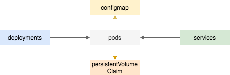

# 实战 | 通过Helm搭建MySQL

## 一、Helm

### 1.1 Install

```bash
# mysql
helm repo add bitnami https://charts.bitnami.com/bitnami
helm repo update
helm search repo mysql

helm show values bitnami/mysql --version 8.9.2 > mysql.yaml-8.9.2-default

# - mysql-standalone.yaml
helm install mysql-standalone bitnami/mysql \
    -f mysql-standalone.yaml-8.9.2 \
    -n kube-server \
    --create-namespace \
    --version 8.9.2 --debug

helm upgrade --install mysql-standalone bitnami/mysql \
    -f mysql-standalone.yaml-8.9.2 \
    -n kube-server \
    --create-namespace \
    --version 8.9.2 --debug    

helm -n kube-server uninstall mysql-standalone

# - mysql-replication.yaml
helm install mysql-replication bitnami/mysql \
    -f mysql-replication.yaml-8.9.2 \
    -n kube-server \
    --create-namespace \
    --version 8.9.2 --debug

helm upgrade --install mysql-replication bitnami/mysql \
    -f mysql-replication.yaml-8.9.2 \
    -n kube-server \
    --create-namespace \
    --version 8.9.2 --debug 

helm -n kube-server uninstall mysql-replication
```


### 1.2 Usage

```yaml
kubectl -n kube-server exec -it pod/mysql-replication-primary-0 sh
mysql -uroot -pjesse

mysql -h10.101.11.182 -P30380 -ugrafana -pgrafana

# Prometheus
create database prometheus_alert;
create user 'prometheus_alert'@'%' identified by 'prometheus_alert';
grant all privileges on prometheus_alert.* to `prometheus_alert`@`%`;
flush privileges;

# JumpServer
create database jumpserver;
create user 'jumpserver'@'%' identified by 'jumpserver';
grant all privileges on jumpserver.* to `jumpserver`@`%`;
flush privileges;
```


## 二、手动

在kubernetes下小试MySQL的搭建


当下最新版本

- 5.7.37
- 8.0.28

搭建方式一样，这里示例搭建5.7.37版本。规划在kubernetes里面搭建mysql-5和mysql-8提供给其他使用。




### 2.1、搭建

#### 2.1.1 PVC

先创建存储

- PersistentVolume，简称pv
- PersistentVolumeClaim，简称pvc

选择其中一台Node节点本地存储（有分布式存储会更方便更友好）

需要提前在目标机器上创建目录`/opt/data/mysql-5`

```yaml
apiVersion: v1
items:
- apiVersion: v1
  kind: PersistentVolume
  metadata:
    annotations:
      pv.kubernetes.io/bound-by-controller: "yes"
    finalizers:
    - kubernetes.io/pv-protection
    labels:
      pvname: pv-mysql-5
    name: pv-mysql-5
  spec:
    accessModes:
    - ReadWriteOnce
    capacity:
      storage: 20Gi
    local:
      path: /opt/data/mysql-5
    nodeAffinity:
      required:
        nodeSelectorTerms:
        - matchExpressions:
          - key: kubernetes.io/hostname
            operator: In
            values:
            - k-kube-lab-09
    persistentVolumeReclaimPolicy: Retain
    storageClassName: mysql-5
    volumeMode: Filesystem
- apiVersion: v1
  kind: PersistentVolumeClaim
  metadata:
    annotations:
      pv.kubernetes.io/bind-completed: "yes"
      pv.kubernetes.io/bound-by-controller: "yes"
    finalizers:
    - kubernetes.io/pvc-protection
    labels:
      addonmanager.kubernetes.io/mode: EnsureExists
      kubernetes.io/cluster-service: "true"
    name: pvc-mysql-5
    namespace: kube-server
  spec:
    accessModes:
    - ReadWriteOnce
    resources:
      requests:
        storage: 20Gi
    storageClassName: mysql-5
    volumeMode: Filesystem
    volumeName: pv-mysql-5
    type: NodePort
kind: List    
```

#### 2.1.2 CM

配置管理

- configmap，简称cm

```yaml
apiVersion: v1
data:
  my.cnf: |
    # For explanations see
    # http://dev.mysql.com/doc/mysql/en/server-system-variables.html
    [mysqld]
    pid-file = /var/run/mysqld/mysqld.pid
    socket   = /var/run/mysqld/mysqld.sock
    datadir  = /var/lib/mysql
    #log-error    = /var/log/mysql/error.log
    #bind-address = 127.0.0.1
    symbolic-links = 0
    skip-host-cache
    skip-name-resolve
    [mysql]
    [mysqldump]
    quick
    quote-names
    max_allowed_packet = 16M
kind: ConfigMap
metadata:
  labels:
    app: mysql-5
    component: mysql
    version: 5.7.37
  name: mysql-5
  namespace: kube-server
```

#### 2.1.3 PO

创建容器

- deployments，简称deploy
- pod，简称po
- service，简称svc

```yaml
apiVersion: v1
items:
- apiVersion: apps/v1
  kind: Deployment
  metadata:
    labels:
      k8s-app: mysql-5
    name: mysql-5
    namespace: kube-server
  spec:
    replicas: 1
    revisionHistoryLimit: 5
    selector:
      matchLabels:
        k8s-app: mysql-5
    strategy:
      rollingUpdate:
        maxSurge: 25%
        maxUnavailable: 25%
      type: RollingUpdate
    template:
      metadata:
        labels:
          k8s-app: mysql-5
      spec:
        containers:
        - env:
          - name: MYSQL_ROOT_PASSWORD
            value: jesse
          image: hub.8ops.top/third/mysql:5.7.37
          imagePullPolicy: IfNotPresent
          name: mysql
          ports:
          - containerPort: 3306
            protocol: TCP
          resources:
            limits:
              cpu: 500m
              memory: 512Mi
            requests:
              cpu: 200m
              memory: 256Mi
          volumeMounts:
          - mountPath: /etc/mysql
            name: mysql-config
          - mountPath: /var/lib/mysql
            name: mysql-data
        dnsPolicy: ClusterFirst
        restartPolicy: Always
        volumes:
        - configMap:
            defaultMode: 420
            name: mysql-5
          name: mysql-config
        - name: mysql-data
          persistentVolumeClaim:
            claimName: pvc-mysql-5
- apiVersion: v1
  kind: Service
  metadata:
    labels:
      k8s-app: mysql-5
    name: mysql-5
    namespace: kube-server
  spec:
    ports:
    - port: 3306
      protocol: TCP
      targetPort: 3306
      nodePort: 30306
    selector:
      k8s-app: mysql-5
    type: NodePort
kind: List
```


### 2.2、验收

#### 2.2.1 存储

```bash
~ $ kubectl -n kube-server get pv,pvc -A
NAME                              CAPACITY   ACCESS MODES   RECLAIM POLICY   STATUS   CLAIM                     STORAGECLASS   REASON   AGE
persistentvolume/pv-mysql-5       20Gi       RWO            Retain           Bound    kube-server/pvc-mysql-5   mysql-5                 3h21m

NAMESPACE     NAME                                  STATUS   VOLUME           CAPACITY   ACCESS MODES   STORAGECLASS   AGE
kube-server   persistentvolumeclaim/pvc-mysql-5     Bound    pv-mysql-5       20Gi       RWO            mysql-5        3h21m

~ $ tree -L 2 /opt/data/
/opt/data/
├── mysql-5
│   ├── auto.cnf
│   ├── ca-key.pem
│   ├── ca.pem
│   ├── client-cert.pem
│   ├── client-key.pem
│   ├── grafana
│   ├── ib_buffer_pool
│   ├── ibdata1
│   ├── ib_logfile0
│   ├── ib_logfile1
│   ├── ibtmp1
│   ├── mysql
│   ├── performance_schema
│   ├── private_key.pem
│   ├── public_key.pem
│   ├── server-cert.pem
│   ├── server-key.pem
│   └── sys
└── mysql-8
```


#### 2.2.2 容器

```bash
~ $ kubectl -n kube-server get cm,po,svc
NAME                                                   DATA   AGE
configmap/mysql-5                                      1      3h24m

NAME                                                       READY   STATUS    RESTARTS        AGE
pod/mysql-5-5499976b7b-ms669                               1/1     Running   0               3h24m

NAME                                          TYPE        CLUSTER-IP        EXTERNAL-IP   PORT(S)          AGE
service/mysql-5                               NodePort    192.168.145.159   <none>        3306:30306/TCP   3h24m
```


#### 2.2.3 访问

```bash
~ $ mysql -h 10.101.11.196 -P30306 -uroot -ppassword
mysql: [Warning] Using a password on the command line interface can be insecure.
Welcome to the MySQL monitor.  Commands end with ; or \g.
Your MySQL connection id is 141
Server version: 5.7.37 MySQL Community Server (GPL)

Copyright (c) 2000, 2020, Oracle and/or its affiliates. All rights reserved.

Oracle is a registered trademark of Oracle Corporation and/or its
affiliates. Other names may be trademarks of their respective
owners.

Type 'help;' or '\h' for help. Type '\c' to clear the current input statement.

mysql> show databases;
+--------------------+
| Database           |
+--------------------+
| information_schema |
| grafana            |
| mysql              |
| performance_schema |
| sys                |
+--------------------+
5 rows in set (0.01 sec)

mysql> show grants;
+-------------------------------------------------------------+
| Grants for root@%                                           |
+-------------------------------------------------------------+
| GRANT ALL PRIVILEGES ON *.* TO 'root'@'%' WITH GRANT OPTION |
+-------------------------------------------------------------+
1 row in set (0.02 sec)

mysql>
```


> 8

```bash
# my.cnf 去掉 symbolic-links = 0
# 连接进数据库创建帐号
CREATE USER 'admin'@'%' IDENTIFIED BY 'password';
GRANT ALL PRIVILEGES ON *.* TO 'admin'@'%';

ALTER USER 'admin'@'%' IDENTIFIED WITH mysql_native_password BY 'password';
FLUSH PRIVILEGES;

SELECT host,user FROM mysql.user;

```

