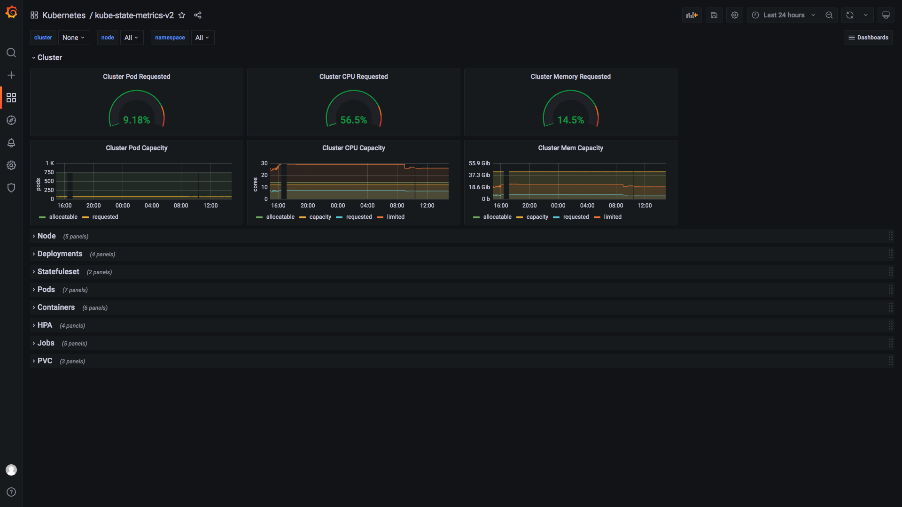
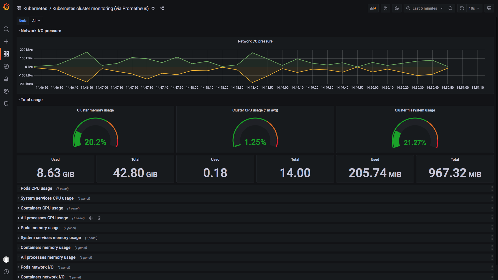
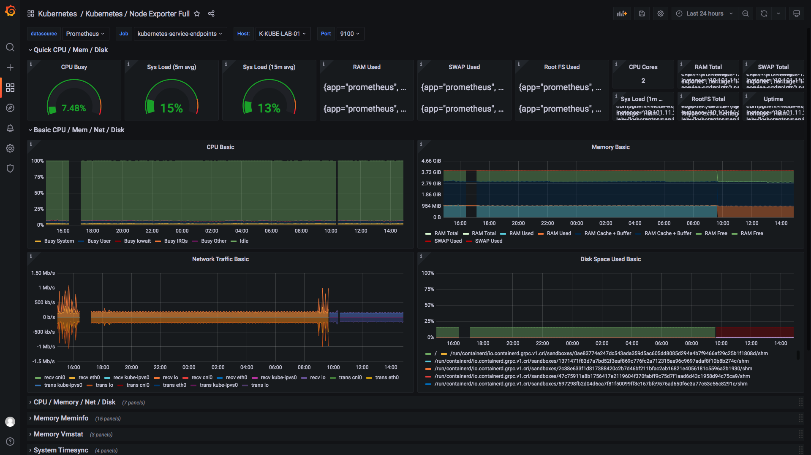
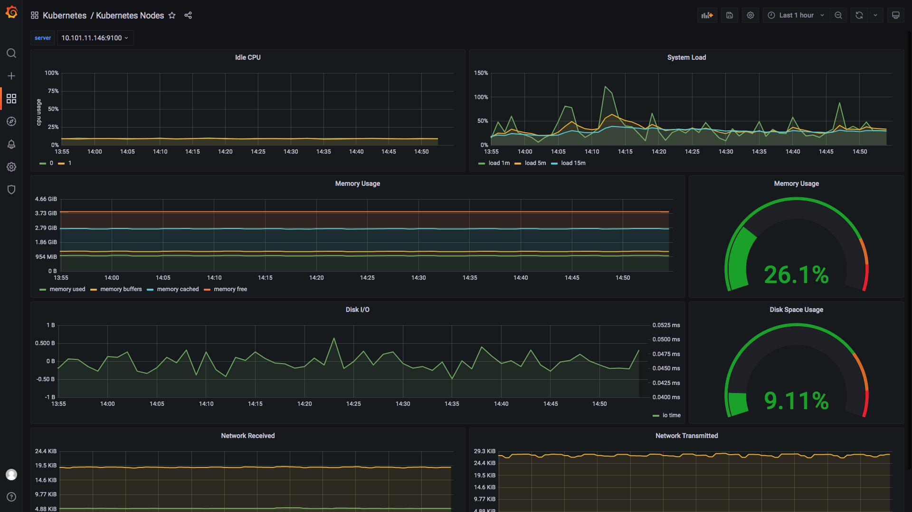
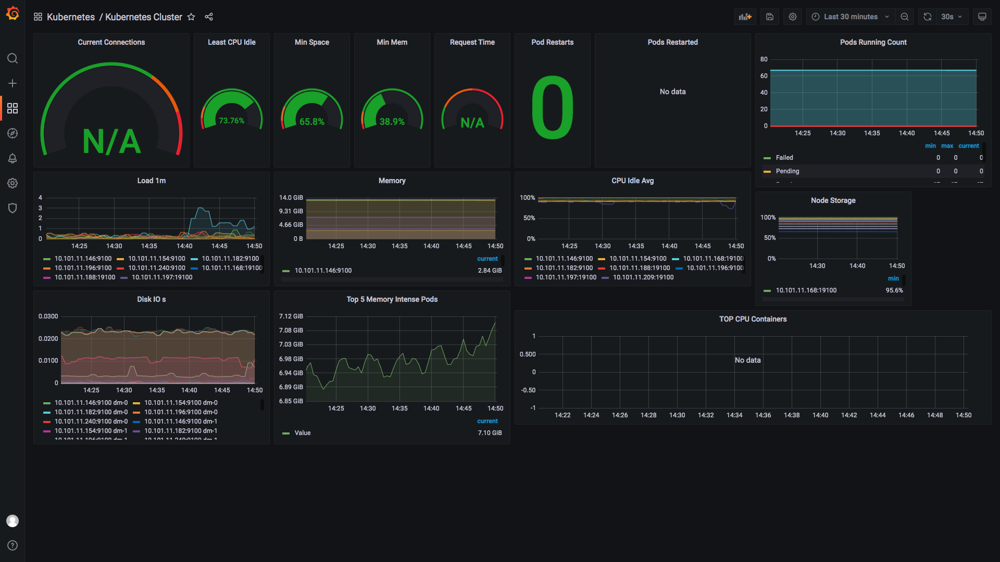
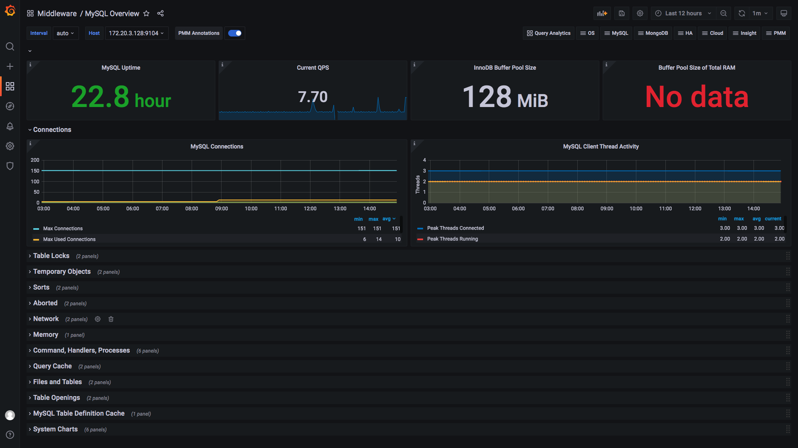
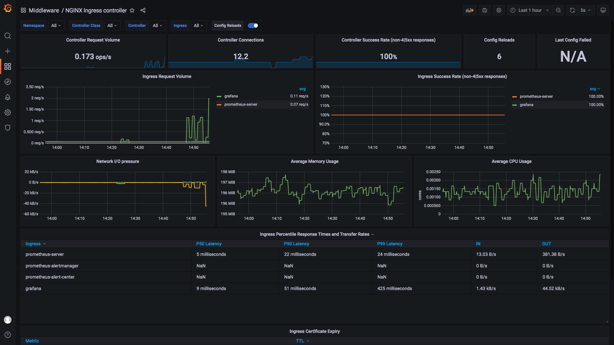
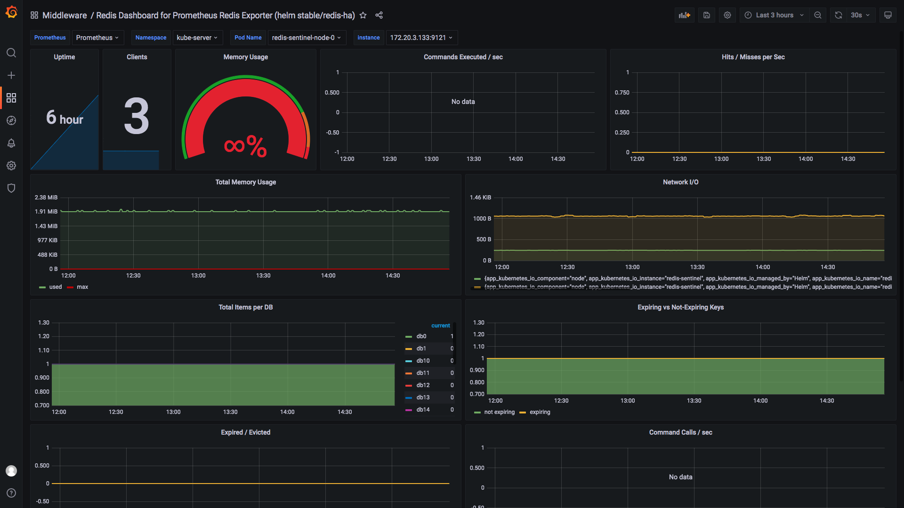

# Helm + Grafana

先准备mysql存储grafana的metedata信息[实战 | 基于Kubernetes使用MySQL](21-mysql.md)

| name     | value   |
| -------- | ------- |
| database | grafana |
| username | grafana |
| password | grafana |


## 一、Install

```bash
helm repo add grafana https://grafana.github.io/helm-charts
helm repo update
helm search repo grafana
 
helm show values grafana/grafana --version 6.38.1 > grafana.yaml-6.38.1-default 

# Example 
#   https://books.8ops.top/attachment/grafana/helm/grafana.yaml-6.38.1
# 

helm install grafana grafana/grafana \
    -f grafana.yaml-6.38.1 \
    -n kube-server \
    --create-namespace \
    --version 6.38.1 --debug

helm upgrade --install grafana grafana/grafana \
    -f grafana.yaml-6.38.1 \
    -n kube-server \
    --create-namespace \
    --version 6.38.1 --debug
    
helm -n kube-server uninstall grafana    

CREATE DATABASE `grafana` DEFAULT CHARACTER SET utf8mb4 COLLATE utf8mb4_0900_ai_ci;

```


## 二、Upgrade

```bash

helm show values grafana/grafana > grafana.yaml-6.38.1-default 

# Example 
#   https://books.8ops.top/attachment/grafana/helm/grafana.yaml-6.38.1
# 

helm install grafana grafana/grafana \
    -f grafana.yaml-6.38.1 \
    -n kube-server \
    --create-namespace \
    --version 6.38.1 --debug
```


## 三、Template


```bash
https://books.8ops.top/attachment/grafana/template/kube-state-metrics.json
https://books.8ops.top/attachment/grafana/template/kubernetes-cluster-monitoring.json
https://books.8ops.top/attachment/grafana/template/kubernetes-cluster-summary.json
https://books.8ops.top/attachment/grafana/template/kubernetes-node-exporter-full.json
https://books.8ops.top/attachment/grafana/template/middleware-mysql-overview.json
https://books.8ops.top/attachment/grafana/template/middleware-nginx-ingress-controller.json
https://books.8ops.top/attachment/grafana/template/middleware-redis-ha.json
```


## 四、演示效果

[官方模板](https://grafana.com/grafana/dashboards/)

















