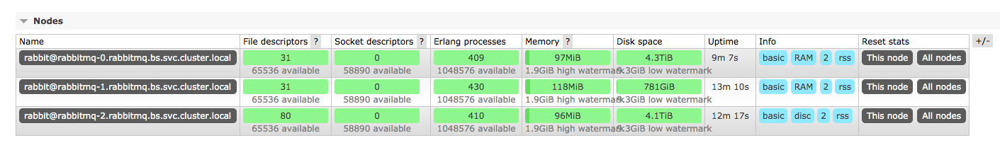

# rabbitmq

<https://www.rabbitmq.com/configure.html>

<https://www.rabbitmq.com/clustering.html>

<http://www.blogjava.net/qbna350816/archive/2016/07/30/431392.html>

<https://www.kubernetes.org.cn/2629.html>


## rbac

```bash
---
apiVersion: v1
kind: ServiceAccount
metadata:
  name: rabbitmq
  namespace: bs
---
kind: Role
apiVersion: rbac.authorization.k8s.io/v1beta1
metadata:
  name: endpoint-reader
  namespace: bs
rules:
- apiGroups: [""]
  resources: ["endpoints"]
  verbs: ["get"]
---
kind: RoleBinding
apiVersion: rbac.authorization.k8s.io/v1beta1
metadata:
  name: endpoint-reader
  namespace: bs
subjects:
- kind: ServiceAccount
  name: rabbitmq
roleRef:
  apiGroup: rbac.authorization.k8s.io
  kind: Role
  name: endpoint-reader
```

## statefulsets

```bash
kind: Service
apiVersion: v1
metadata:
  namespace: bs
  name: rabbitmq
  labels:
    app: rabbitmq
    type: LoadBalancer
spec:
  type: NodePort
  ports:
   - name: http
     protocol: TCP
     port: 15672
     targetPort: 15672
     nodePort: 31672
   - name: amqp
     protocol: TCP
     port: 5672
     targetPort: 5672
     nodePort: 30672
  selector:
    app: rabbitmq
---
apiVersion: v1
kind: ConfigMap
metadata:
  name: rabbitmq-config
  namespace: bs
data:
  enabled_plugins: |
      [rabbitmq_management,rabbitmq_peer_discovery_k8s].

  rabbitmq.conf: |
      ## Cluster formation. See https://www.rabbitmq.com/cluster-formation.html to learn more.
      cluster_formation.peer_discovery_backend  = rabbit_peer_discovery_k8s
      cluster_formation.k8s.host = kubernetes.default.svc.cluster.local
      ## Should RabbitMQ node name be computed from the pod's hostname or IP address?
      ## IP addresses are not stable, so using [stable] hostnames is recommended when possible.
      ## Set to "hostname" to use pod hostnames.
      ## When this value is changed, so should the variable used to set the RABBITMQ_NODENAME
      ## environment variable.
      cluster_formation.k8s.address_type = hostname
      ## How often should node cleanup checks run?
      cluster_formation.node_cleanup.interval = 30
      ## Set to false if automatic removal of unknown/absent nodes
      ## is desired. This can be dangerous, see
      ##  * https://www.rabbitmq.com/cluster-formation.html#node-health-checks-and-cleanup
      ##  * https://groups.google.com/forum/#!msg/rabbitmq-users/wuOfzEywHXo/k8z_HWIkBgAJ
      cluster_formation.node_cleanup.only_log_warning = true
      cluster_partition_handling = autoheal
      ## See https://www.rabbitmq.com/ha.html#master-migration-data-locality
      queue_master_locator=min-masters
      ## See https://www.rabbitmq.com/access-control.html#loopback-users
      loopback_users.guest = false

      vm_memory_high_watermark.absolute = 2GB
      disk_free_limit.absolute = 10GB
      vm_memory_high_watermark_paging_ratio = 0.8
      log.file.level = error

---
apiVersion: apps/v1beta1
kind: StatefulSet
metadata:
  name: rabbitmq
  namespace: bs
spec:
  serviceName: rabbitmq
  replicas: 3
  template:
    metadata:
      labels:
        app: rabbitmq
    spec:
      serviceAccountName: rabbitmq
      terminationGracePeriodSeconds: 10
      containers:
      - name: rabbitmq-k8s
        image: rabbitmq:3.7.17
        resources:
          limits:
            cpu: 1
            memory: 2048Mi
          requests:
            cpu: 0.1
            memory: 512Mi
        volumeMounts:
          - name: config-volume
            mountPath: /etc/rabbitmq
        ports:
          - name: http
            protocol: TCP
            containerPort: 15672
          - name: amqp
            protocol: TCP
            containerPort: 5672
        livenessProbe:
          exec:
            command: ["rabbitmqctl", "status"]
          initialDelaySeconds: 60
          # See https://www.rabbitmq.com/monitoring.html for monitoring frequency recommendations.
          periodSeconds: 60
          timeoutSeconds: 15
        readinessProbe:
          exec:
            command: ["rabbitmqctl", "status"]
          initialDelaySeconds: 20
          periodSeconds: 60
          timeoutSeconds: 10
        imagePullPolicy: Always
        env:
          - name: MY_POD_NAME
            valueFrom:
              fieldRef:
                apiVersion: v1
                fieldPath: metadata.name
          - name: MY_POD_NAMESPACE
            valueFrom:
              fieldRef:
                fieldPath: metadata.namespace
          - name: MY_POD_SERVICE_ACCOUNT
            valueFrom:
              fieldRef:
                fieldPath: spec.serviceAccountName
          - name: RABBITMQ_USE_LONGNAME
            value: "true"
          # See a note on cluster_formation.k8s.address_type in the config file section
          - name: RABBITMQ_NODENAME
            value: rabbit@$(MY_POD_NAME).$(MY_POD_SERVICE_ACCOUNT).$(MY_POD_NAMESPACE).svc.cluster.local
          - name: K8S_HOSTNAME_SUFFIX
            value: .$(MY_POD_SERVICE_ACCOUNT).$(MY_POD_NAMESPACE).svc.cluster.local
          - name: K8S_SERVICE_NAME
            value: $(MY_POD_SERVICE_ACCOUNT)
          - name: RABBITMQ_ERLANG_COOKIE
            value: "mycookie"
      volumes:
        - name: config-volume
          configMap:
            name: rabbitmq-config
            items:
            - key: rabbitmq.conf
              path: rabbitmq.conf
            - key: enabled_plugins
              path: enabled_plugins
```

## cmd

```bash
rabbitmqctl status

[{pid,236},
 {running_applications,
     [{rabbitmq_management,"RabbitMQ Management Console","3.7.17"},
      {rabbitmq_web_dispatch,"RabbitMQ Web Dispatcher","3.7.17"},
      {cowboy,"Small, fast, modern HTTP server.","2.6.1"},
      {cowlib,"Support library for manipulating Web protocols.","2.7.0"},
      {amqp_client,"RabbitMQ AMQP Client","3.7.17"},
      {rabbitmq_peer_discovery_k8s,
          "Kubernetes-based RabbitMQ peer discovery backend","3.7.17"},
      {rabbitmq_management_agent,"RabbitMQ Management Agent","3.7.17"},
      {rabbitmq_peer_discovery_common,
          "Modules shared by various peer discovery backends","3.7.17"},
      {rabbit,"RabbitMQ","3.7.17"},
      {rabbit_common,
          "Modules shared by rabbitmq-server and rabbitmq-erlang-client",
          "3.7.17"},
      {ranch,"Socket acceptor pool for TCP protocols.","1.7.1"},
      {ssl,"Erlang/OTP SSL application","9.3.5"},
      {public_key,"Public key infrastructure","1.6.7"},
      {asn1,"The Erlang ASN1 compiler version 5.0.9","5.0.9"},
      {mnesia,"MNESIA  CXC 138 12","4.16"},
      {stdout_formatter,
          "Tools to format paragraphs, lists and tables as plain text",
          "0.2.2"},
      {jsx,"a streaming, evented json parsing toolkit","2.9.0"},
      {observer_cli,"Visualize Erlang Nodes On The Command Line","1.5.0"},
      {xmerl,"XML parser","1.3.21"},
      {crypto,"CRYPTO","4.5.1"},
      {inets,"INETS  CXC 138 49","7.0.9"},
      {sysmon_handler,"Rate-limiting system_monitor event handler","1.1.0"},
      {os_mon,"CPO  CXC 138 46","2.5"},
      {recon,"Diagnostic tools for production use","2.5.0"},
      {lager,"Erlang logging framework","3.6.10"},
      {goldrush,"Erlang event stream processor","0.1.9"},
      {compiler,"ERTS  CXC 138 10","7.4.4"},
      {syntax_tools,"Syntax tools","2.2"},
      {sasl,"SASL  CXC 138 11","3.4"},
      {stdlib,"ERTS  CXC 138 10","3.9.2"},
      {kernel,"ERTS  CXC 138 10","6.4.1"}]},
 {os,{unix,linux}},
 {erlang_version,
     "Erlang/OTP 22 [erts-10.4.4] [source] [64-bit] [smp:20:20] [ds:20:20:10] [async-threads:320]\n"},
 {memory,
     [{connection_readers,0},
      {connection_writers,0},
      {connection_channels,0},
      {connection_other,2732},
      {queue_procs,0},
      {queue_slave_procs,0},
      {plugins,1692252},
      {other_proc,22360772},
      {metrics,208948},
      {mgmt_db,186936},
      {mnesia,84264},
      {other_ets,2841448},
      {binary,226832},
      {msg_index,31760},
      {code,27517311},
      {atom,1221849},
      {other_system,20547936},
      {allocated_unused,35446624},
      {reserved_unallocated,0},
      {strategy,rss},
      {total,[{erlang,76923040},{rss,102756352},{allocated,112369664}]}]},
 {alarms,[]},
 {listeners,[{clustering,25672,"::"},{amqp,5672,"::"},{http,15672,"::"}]},
 {vm_memory_calculation_strategy,rss},
 {vm_memory_high_watermark,0.4},
 {vm_memory_limit,26914172108},
 {disk_free_limit,50000000},
 {disk_free,4923085348864},
 {file_descriptors,
     [{total_limit,65436},
      {total_used,2},
      {sockets_limit,58890},
      {sockets_used,0}]},
 {processes,[{limit,1048576},{used,412}]},
 {run_queue,1},
 {uptime,635},
 {kernel,{net_ticktime,60}}]


rabbitmqctl cluster_status

Cluster status of node rabbit@rabbitmq-0.rabbitmq.bs.svc.cluster.local ...
[{nodes,[{disc,['rabbit@rabbitmq-0.rabbitmq.bs.svc.cluster.local',
                'rabbit@rabbitmq-1.rabbitmq.bs.svc.cluster.local',
                'rabbit@rabbitmq-2.rabbitmq.bs.svc.cluster.local']}]},
 {running_nodes,['rabbit@rabbitmq-1.rabbitmq.bs.svc.cluster.local',
                 'rabbit@rabbitmq-2.rabbitmq.bs.svc.cluster.local',
                 'rabbit@rabbitmq-0.rabbitmq.bs.svc.cluster.local']},
 {cluster_name,<<"rabbit@rabbitmq-0.rabbitmq.bs.svc.cluster.local">>},
 {partitions,[]},
 {alarms,[{'rabbit@rabbitmq-1.rabbitmq.bs.svc.cluster.local',[]},
          {'rabbit@rabbitmq-2.rabbitmq.bs.svc.cluster.local',[]},
          {'rabbit@rabbitmq-0.rabbitmq.bs.svc.cluster.local',[]}]}]


rabbitmqctl stop_app;rabbitmqctl change_cluster_node_type ram;rabbitmqctl start_app
```





