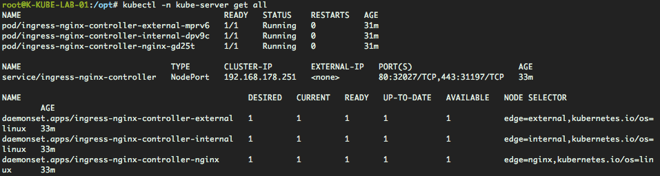
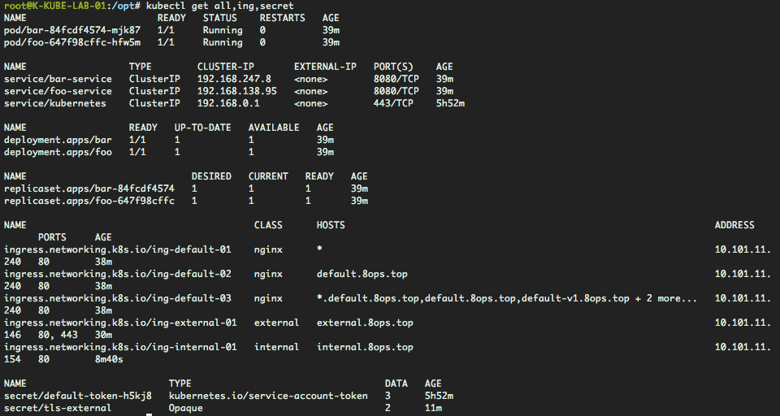
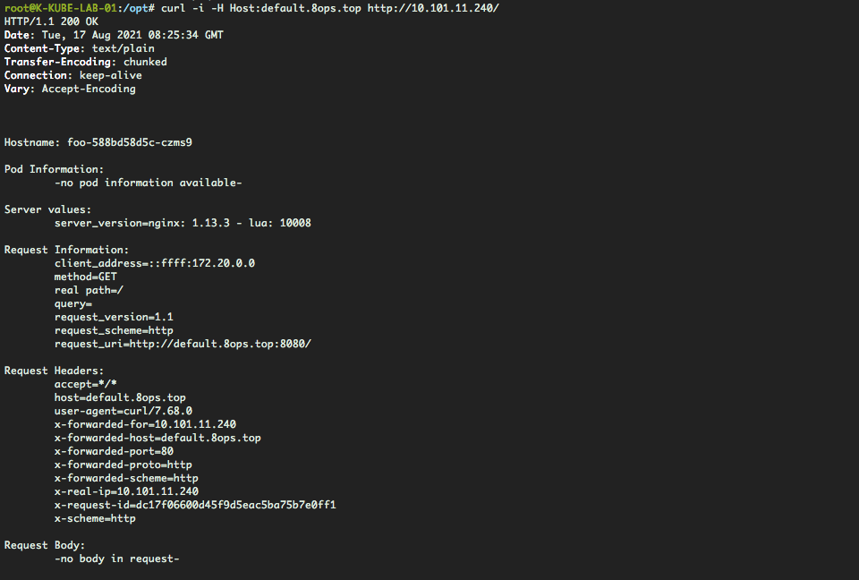
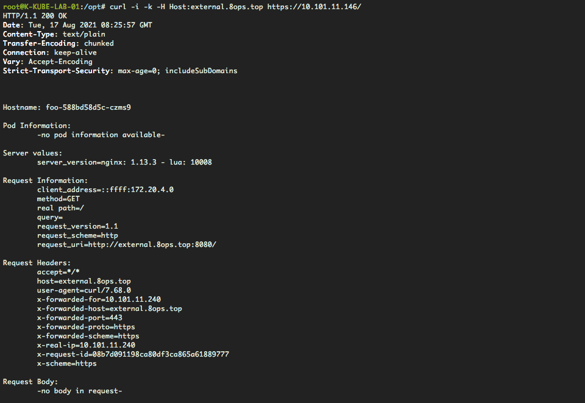
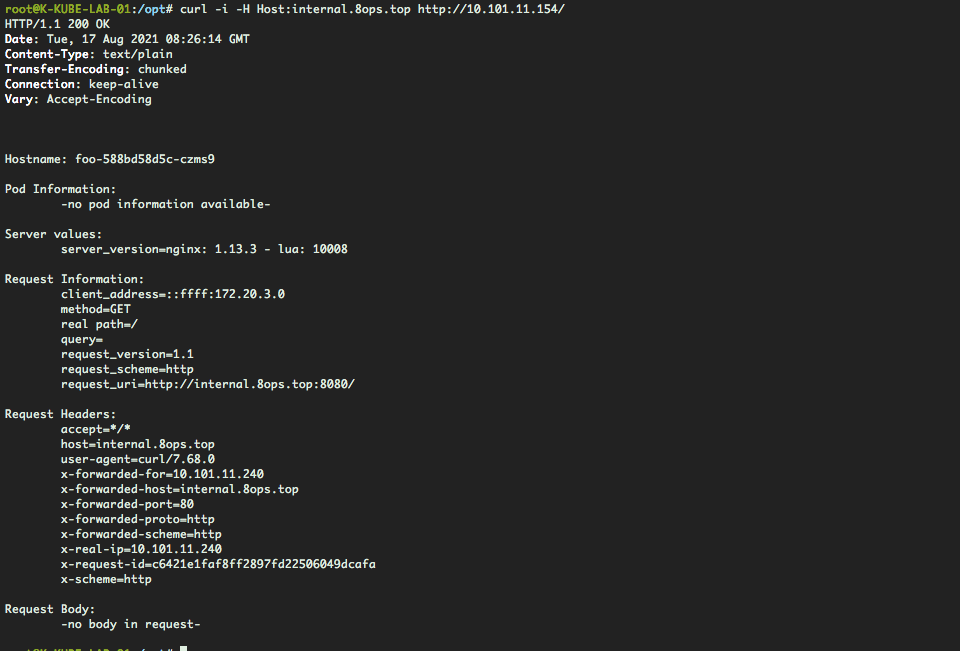

# Ingress-Controller

推荐使用helm安装，参考[Helm](05-helm.md)


Kubernetes 编排管理的Web应用需要对外暴露访问，这种方式叫流量控制。

> 目前常用流量控制的技术有好几种，整理如下

- [ingress-nginx](https://github.com/kubernetes/ingress-nginx)
- [nginxinc](https://github.com/nginxinc/kubernetes-ingress)
- [kong](https://github.com/Kong/kubernetes-ingress-controller)
- [traefik](https://github.com/containous/traefik)
- [haproxy](https://github.com/jcmoraisjr/haproxy-ingress)
- [voyager](https://github.com/appscode/voyager)
- [contour](https://github.com/heptio/contour)
- [istio](https://istio.io/docs/tasks/traffic-management/ingress)
- [ambassador](https://github.com/datawire/ambassador)
- [gloo](https://github.com/solo-io/gloo)
- [skipper](https://github.com/zalando/skipper)


这里我们演示使用ingress-nginx

> 相关引用

- [code](http://github.com/kubernetes/ingress-nginx)
- [docs](https://kind.sigs.k8s.io/docs/user/ingress/#ingress-nginx)
- [guide](https://kubernetes.io/zh/docs/concepts/services-networking/ingress/)
- [nginx](https://docs.nginx.com/nginx-ingress-controller/installation/running-multiple-ingress-controllers/)
- [configmap](https://kubernetes.github.io/ingress-nginx/user-guide/nginx-configuration/configmap/)
- [metallb](https://metallb.universe.tf/)


ingress-nginx是google官方基于nginx最新版本，通过Lua动态加载nginx配置，其配置来源于ingress资源。


## 一、环境说明

| 主机名称      | 主机IP        | 操作系统           | 角色分配             | IngressClass |
| ------------- | ------------- | ------------------ | -------------------- | ------------ |
| K-KUBE-LAB-01 | 10.101.11.240 | Ubuntu 20.04.2 LTS | control-plane,master | nginx        |
| K-KUBE-LAB-02 | 10.101.11.146 | Ubuntu 20.04.2 LTS | control-plane,master | external     |
| K-KUBE-LAB-03 | 10.101.11.154 | Ubuntu 20.04.2 LTS | control-plane,master | internal     |
| K-KUBE-LAB-04 | 10.101.11.234 | Ubuntu 20.04.2 LTS | node                 |              |
| K-KUBE-LAB-05 | 10.101.11.171 | Ubuntu 20.04.2 LTS | node                 |              |

这里使用3台control-plane,master节点分别暴露流量。


## 二、启动控制器

```bash
# 取消control-plane,master节点不可调度
kubectl taint node --all node-role.kubernetes.io/master:NoSchedule-

# 分别从control-plane,master打标签
kubectl label node k-kube-lab-01 edge=nginx
kubectl label node k-kube-lab-02 edge=external
kubectl label node k-kube-lab-03 edge=internal

# 快速创建ingress-nginx-controller
kubectl apply -f https://books.8ops.top/attachment/kubernetes/addon/02-ingress-controller.yaml

# 移除admission and job
kubectl -n kube-server delete ValidatingWebhookConfiguration/ingress-nginx-admission job.batch/ingress-nginx-admission-create job.batch/ingress-nginx-admission-patch service/ingress-nginx-controller-admission
```


> 演示效果




## 三、实践应用

### 3.1 快速应用

> 创建多个IngressClass

分别是：

1. nginx（default）
2. external
3. internal

```bash
# 创建IngressClass
kubectl apply -f https://books.8ops.top/attachment/kubernetes/addon/02-ingress-controller/01-ingressclass.yaml

# 创建应用：方式一（此处选用）
kubectl apply -f https://books.8ops.top/attachment/kubernetes/addon/02-ingress-controller/02-app-echoserver.yaml

# 创建应用：方式二
kubectl apply -f https://books.8ops.top/attachment/kubernetes/addon/02-ingress-controller/02-app-http-echo.yaml

# 创建应用：方式三
kubectl apply -f https://books.8ops.top/attachment/kubernetes/addon/02-ingress-controller/02-app-nginx.yaml

# 暴露流量：方式一（nginx）
kubectl apply -f https://books.8ops.top/attachment/kubernetes/addon/02-ingress-controller/03-ing-default.yaml

# 暴露流量：方式二（external）
kubectl apply -f https://books.8ops.top/attachment/kubernetes/addon/02-ingress-controller/04-ing-external.yaml

# 暴露流量：方式三（internal）
kubectl apply -f https://books.8ops.top/attachment/kubernetes/addon/02-ingress-controller/05-ing-internal.yaml
```


> 演示效果




### 3.2 查看效果

```bash
# nginx（default）
curl -i -H Host:default.8ops.top http://10.101.11.240/

# external
curl -i -k -H Host:external.8ops.top https://10.101.11.146/

# internal
curl -i -H Host:internal.8ops.top http://10.101.11.154/
```


> 演示效果










