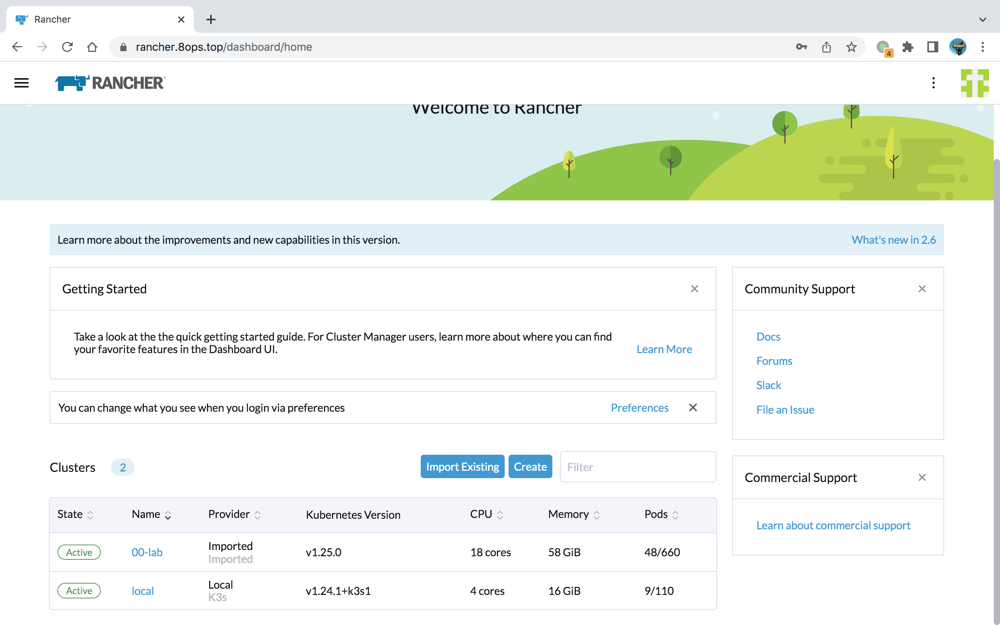
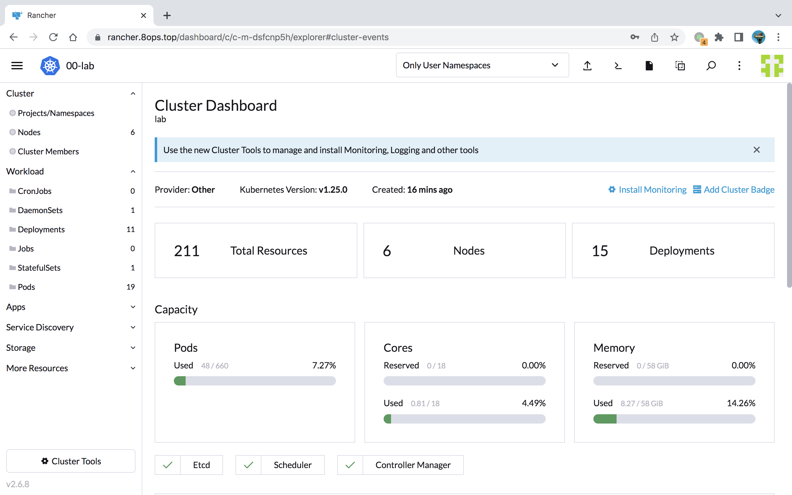

# 实战 | Rancher 初识

[docs](https://docs.rancher.cn)


## 一、单体安装

### 1.1 安装过程

```bash
# 自签证书
docker run -d --restart=unless-stopped \
  --name rancher \
  -p 80:80 -p 443:443 \
  --privileged \
  hub.8ops.top/google_containers/rancher:v2.6.8 

# 公有证书
docker run -d --privileged --restart=unless-stopped \
  --name rancher \
  -p 80:80 -p 443:443 \
  -v /opt/certs/8ops.top.crt:/etc/rancher/ssl/cert.pem \
  -v /opt/certs/8ops.top.key:/etc/rancher/ssl/key.pem \
  hub.8ops.top/google_containers/rancher:v2.6.8 \
  --no-cacerts

# --------- Join Cluster --------- #
# Existing Cluster
# Example
#    https://books.8ops.top/attachment/kubernetes/20-rancher-agent.yaml
kubectl apply -f 20-rancher-agent.yaml

# Create Cluster
docker run -d --privileged --restart=unless-stopped --net=host \
    -v /etc/kubernetes:/etc/kubernetes \
    -v /var/run:/var/run \
    hub.8ops.top/google_containers/rancher-agent:v2.6.8 \
    --server https://rancher.8ops.top \
    --token bshb2rg26cxlpwrrzvbg4jg4n7ddr8hhmwcs4l45wl7ntjxrqgntb2 \
    --etcd --controlplane --worker
```


### 1.2 演示效果

`https://rancher.8ops.top`

```bash
# 获取密码
docker logs  rancher  2>&1 | grep "Bootstrap Password:"

# 第一次登录需要重置密码
admin / rancher@2022
```


> Existing Cluster






> Create Cluster


## 二、基于 Helm 安装


```bash
helm repo add rancher https://releases.rancher.com/server-charts/latest
helm search repo rancher
helm show values rancher/rancher > rancher.yaml-2.6.8-default

helm install rancher rancher/rancher \
    -f rancher.yaml-2.6.8 \
    -n kube-cattle \
    --create-namespace \
    --version 2.6.8 --debug
```

- 未成功，当前最高版本的 2.6.8 仅支持 < kubenetes v1.25.0-0
