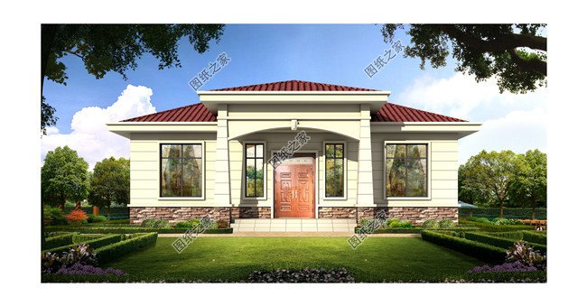
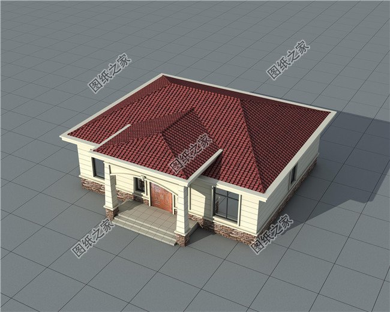
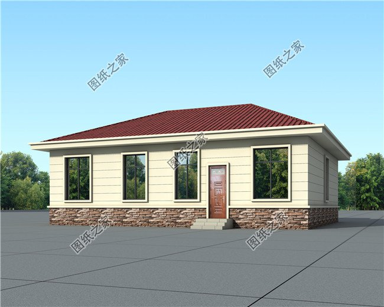
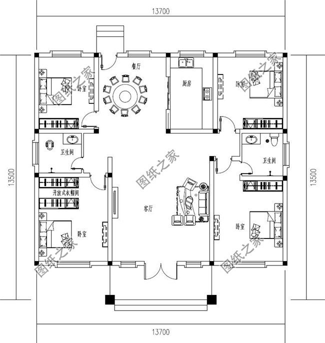

# 00-01

**图纸介绍：**农村17万元一层自建别墅设计图，外观简洁，户型方正，外墙采用比较耐看的明黄色装饰，屋顶坡面设计，采用红色砖瓦，室内共设有4间卧室，各空间布局宽敞明亮，住在里面能让人心情舒适

**占地面积：**13.7m*13.5m，163平方米左右；

**建筑层高：**一层；

**建筑高度：**6.8米（含屋顶）；

**设计功能：**

一层户型：客厅、餐厅、厨房、卧室x3、卧室（带卫生间）、卫生间；

**图纸目录：**

建 筑 图：建筑设计说明、一层平面图、屋顶平面图、正立面图、背立面图、左立面图、右立面图、1-1剖面图、楼梯大样图、门斗大样图、节点大样图、门窗详图、门窗表等；

结 构 图：结构设计说明、基础平面布置图、基础大样图、一层梁结构平面图、、屋顶梁结构平面图、一层板结构平面图、屋面板结构平面图、楼梯大样图、节点大样图等；

给排水图：给排水设计说明、一层给排水平面图、屋顶给排水平面图、卫生间大样图、给排水系统图等；

电 气 图：电气设计说明、配电系统图、弱电系统图、配电干线系统图、一层照明平面图、一层插座平面图、一层弱电平面图、接地平面图、屋顶防雷平面图等；

