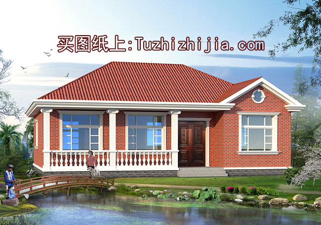
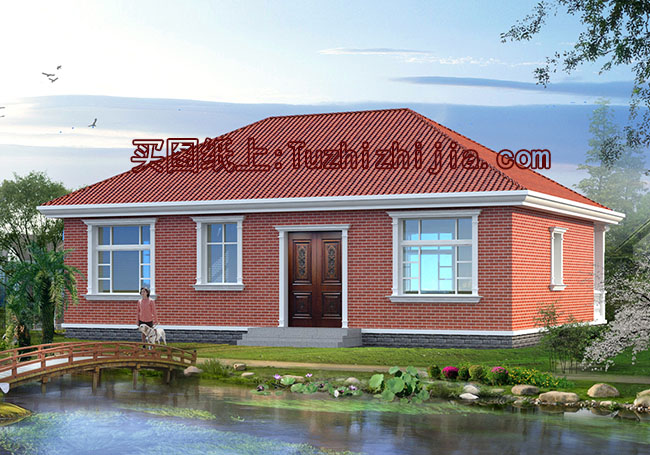
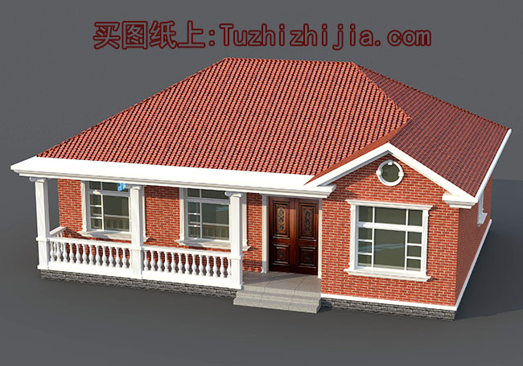
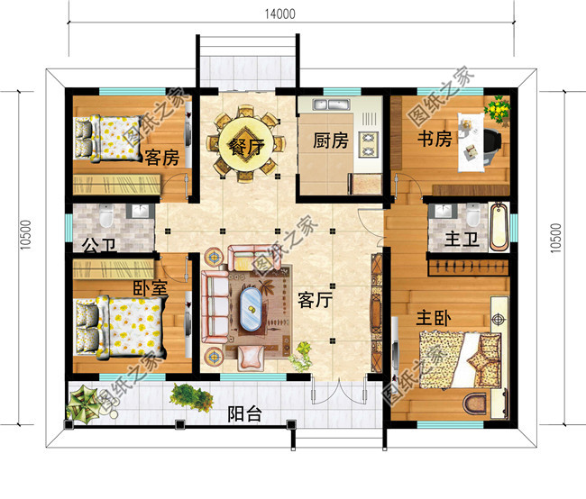
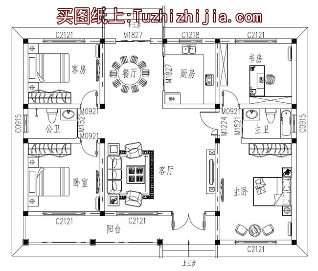
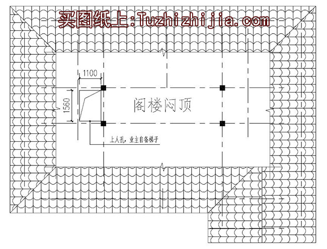
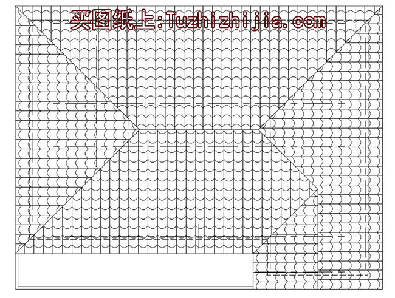
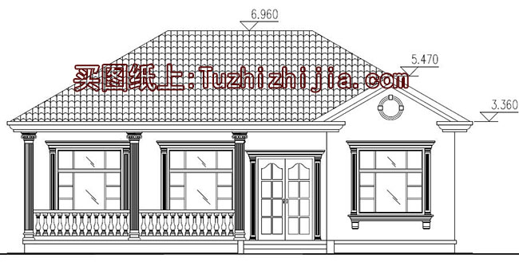
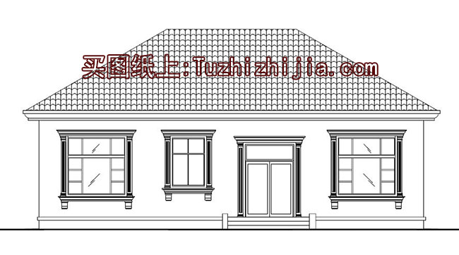

# 00-02

**图纸介绍**：本户型为漂亮、美观的一层平房设计图，含外观图片，内部布局非常合理，南北通透，采光优良，4室两厅两卫。

**占地面积**：14.0m*10.5m，建筑面积145平左右；

**建筑层高**：一层；

**建筑高度**：6.50米（含屋顶）；

**设计功能**：

一层户型设计：客厅、餐厅、厨房、主卧（带卫生间）、卧室x2、书房、卫生间；

**图纸目录**：

建筑图：图纸目录、建筑设计说明、一层平面图、屋顶平面图、立面图x4、剖面图、节点大样图、门头大样图、楼梯大样图、门窗表等；

结构图：图纸目录、结构设计说明、基础平面布置图、基础大样图、基础梁平面图、一层梁结构平面图、屋顶梁结构平面图、一层结构平面图、屋顶结构平面图等；

给排水图：图纸目录、给排水设计说明、一层给排水平面图、给排水系统图等；

电气图：图纸目录、电气设计说明、配电系统图、一层照明平面图、一层插座平面图、一层弱电平面图、屋顶防雷平面图等。

