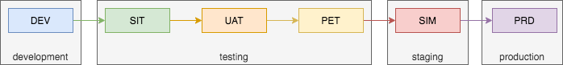

# DevOps

[Reference](https://docs.gitlab.com/ee/ci/environments/)

## 一、Deployment tier of environments

[Introduced](https://gitlab.com/gitlab-org/gitlab/-/issues/300741) in GitLab 13.10.

Sometimes, instead of using an [industry standard](https://en.wikipedia.org/wiki/Deployment_environment) environment name, like `production`, you might want to use a code name, like `customer-portal`. While there is no technical reason not to use a name like `customer-portal`, the name no longer indicates that the environment is used for production.

To indicate that a specific environment is for a specific use, you can use tiers:

| Environment tier | Environment name examples                                    |
| :--------------- | :----------------------------------------------------------- |
| `production`     | Production, Live                                             |
| `staging`        | Staging, Model, Demo                                         |
| `testing`        | Test, QC                                                     |
| `development`    | Dev, [Review apps](https://docs.gitlab.com/ee/ci/review_apps/index.html), Trunk |
| `other`          |                                                              |

By default, GitLab assumes a tier based on [the environment name](https://docs.gitlab.com/ee/ci/yaml/index.html#environmentname). Instead, you can use the [`deployment_tier` keyword](https://docs.gitlab.com/ee/ci/yaml/index.html#environmentdeployment_tier) to specify a tier.

## 一、环境管理

> 按照交付顺序

- DEV Development 研发环境

- SIT System Integrate Test 系统集成测试环境（内测）

- UAT User Acceptance Test 用户验收测试环境

- PET Performance Evaluation Test 性能评估测试环境（压测）

- SIM Simulation 高仿真环境

- PRD/PROD Production 正式/生产环境

