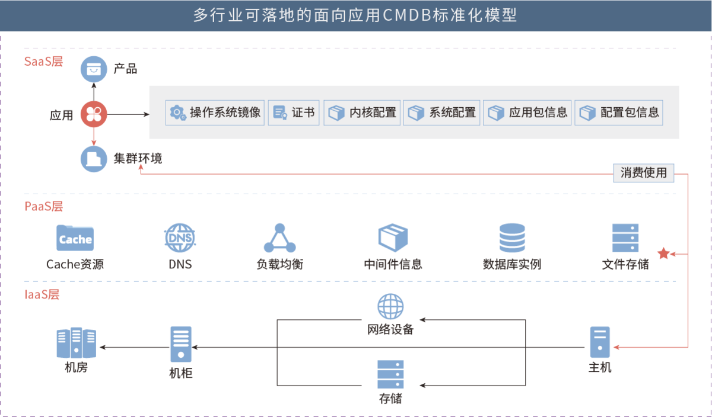
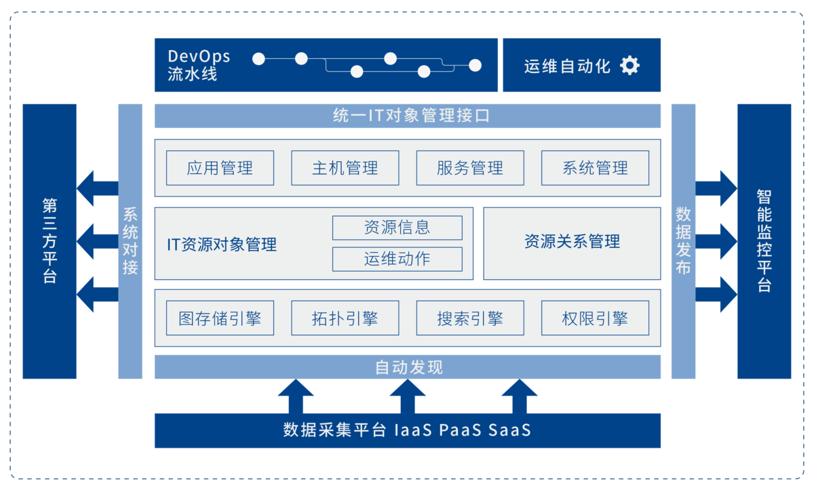
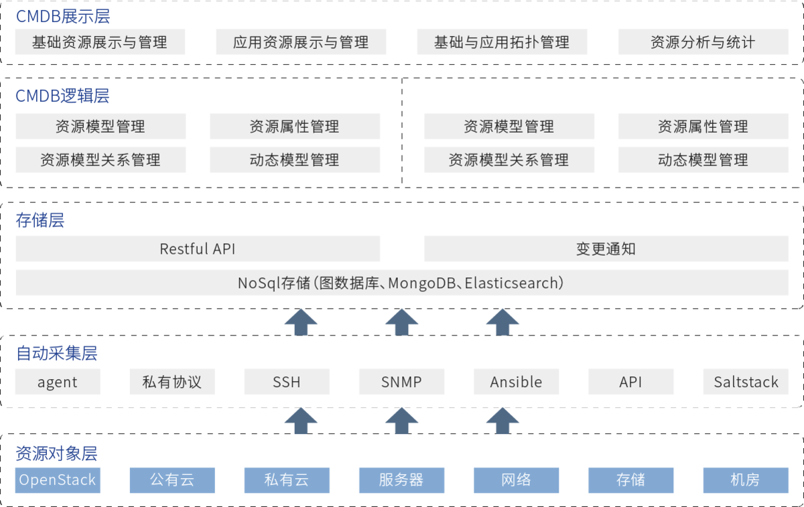
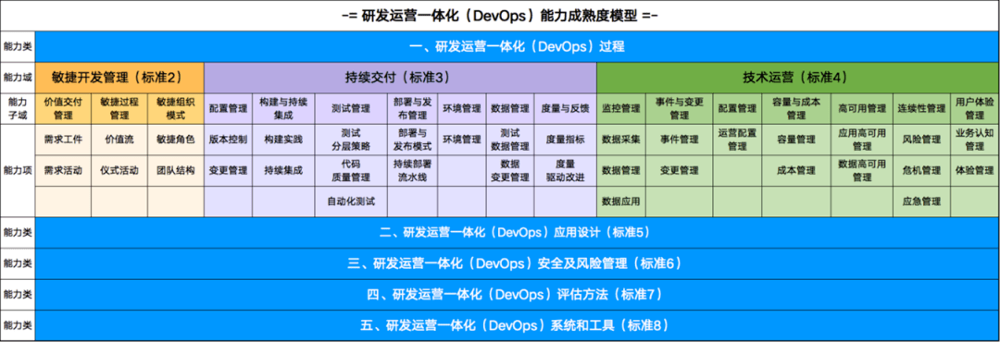
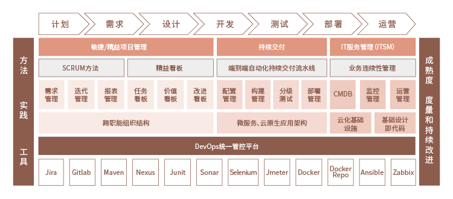
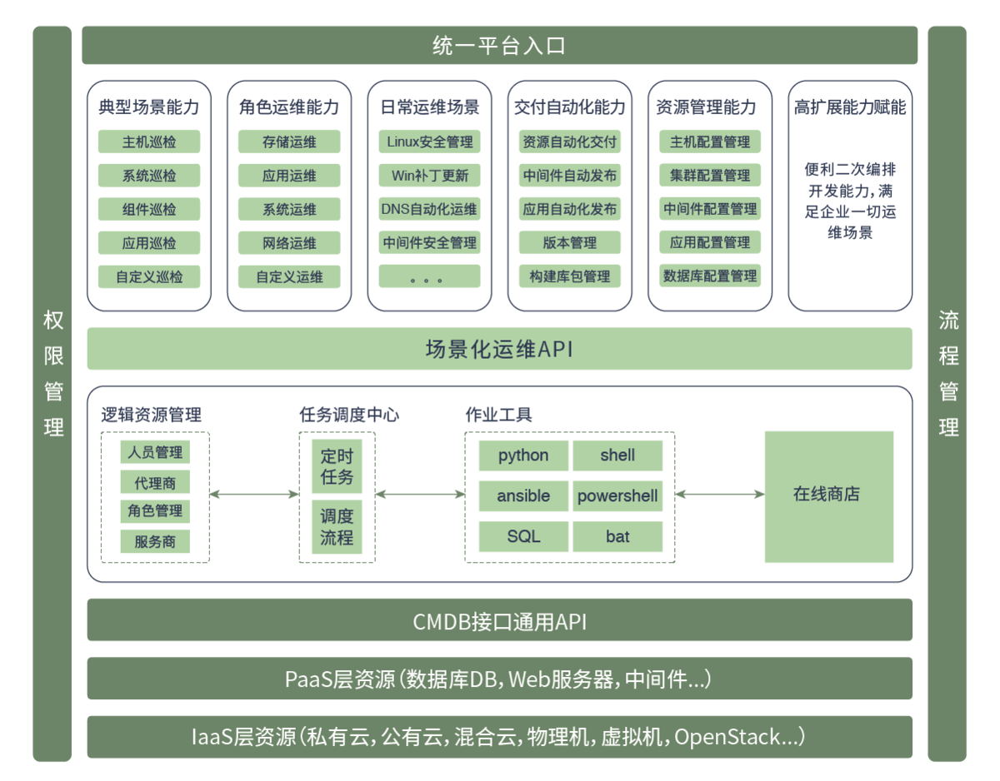
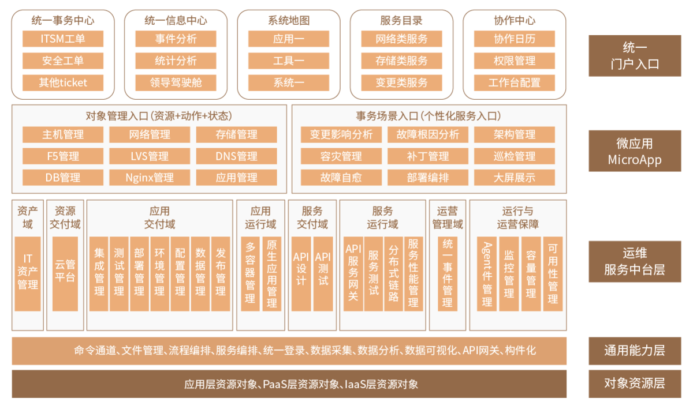
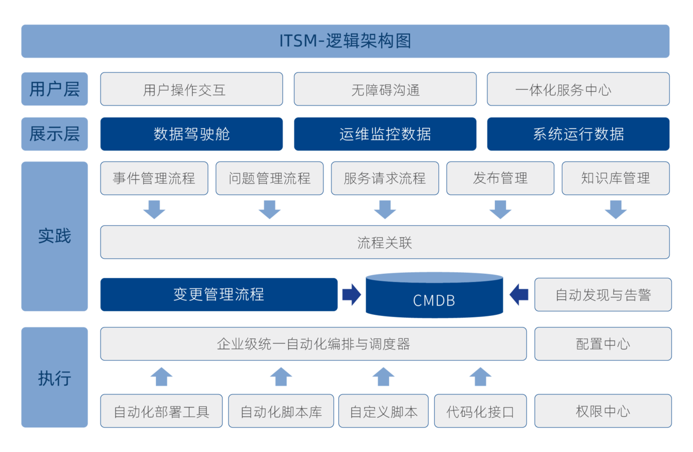

# AutoOps

摘录于[优维科技](https://www.uwintech.cn/)

## 一、CMDB

结合传统运维演变，新型运维方式的基础支持。所谓工欲善于其事必先利其器，一个好的CMDB管理才能让你有更好的上层拓展能力。

### 1.1 落地场景

### 1.2 功能架构

### 1.3 技术架构

## 二、DevOps

### 2.1 原型

### 2.2 能力成熟度

经信通院认证，行业共识形成的能力成熟度模型。

### 2.3 架构

## 三、其他能力

### 3.1 运维能力

### 3.2 门户能力

### 3.3 服务中心

