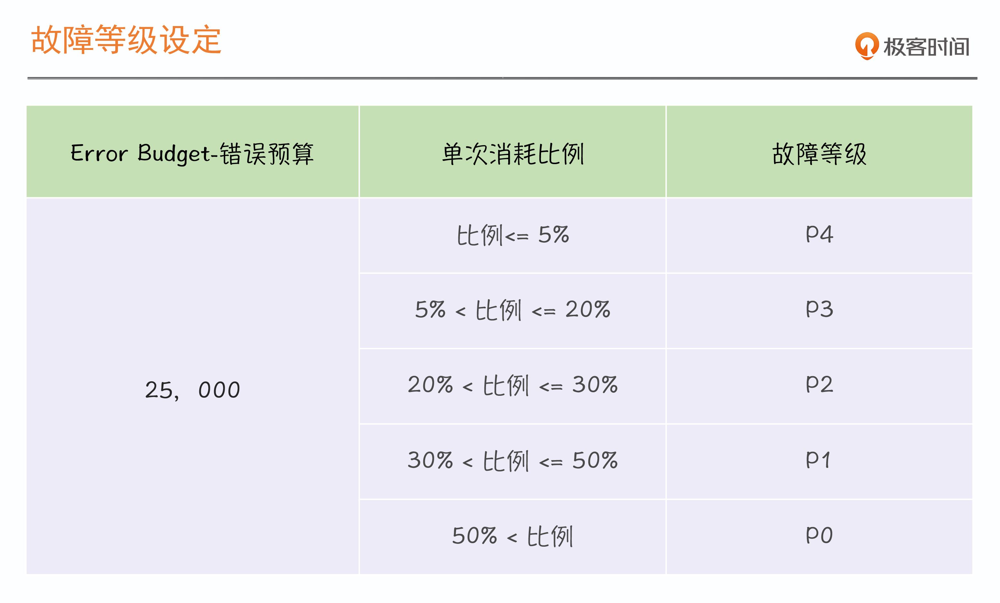

# 04 | 错误预算：达成稳定性目标的共识机制

上一讲是我们引入SRE的关键，我们掌握了选择SLI指标和设定SLO目标的方法。你可以先回顾一下内容，看看是不是能回答这三个问题：选择SLI的两大原则是什么？VALET法则是什么？怎么来计算SLO？如果答案都很清晰，那么恭喜你，你攻克了SRE的一个关键知识点；如果有点模糊，那就回去复习一下，咱不求快，但求扎实。

今天，我们就顺着SLO这条线，继续深入，一起来看有了SLO之后，围绕着它我们可以做哪些事情，或者说我们具体应该怎么来应用SLO呢？还有，SLO设定后，是合理还是不合理，我们应该用什么样的方法来评估呢？如果设定得不合理，我们又应该怎么来调整呢？

带着这些问题，开始我们今天的学习。

## 落地SLO，先转化为Error Budget

SLO是目标，定目标总是一件激动人心的事，但是目标定了之后，这个目标怎么能指导我们的具体工作呢，有时候就没那么一目了然了。

这么说有点抽象，我举个生活中的例子。你通过好几轮考试，拿到了驾照，现在你可以开车上路了。交管局的目标就是你要遵守交规，安全驾驶。这个目标咋实现呢？我们都知道了，就是驾照记分制。你的驾照在1年的这个周期里，总共有12分，扣完了驾照失效，这样你就会关注自己还有几分，特别注意交规。用这个方式，就把你要趋近100%遵守交规的目标转变为你一年只有12分可扣，一个大目标就有了很具体的落地形式。

那同样，SLO目标定好了，很具体，但实施起来不直观，那我们是不是也可以反过来看，制定出一个允许犯错的次数标准，这样我们就监控这些错误就好了。

没错，SRE还真是这么做的，这个概念叫做Error Budget，翻译过来就是错误预算。

错误预算其实和驾照记分制是一样的，**最大的作用就是“提示你还有多少次犯错的机会”**，并且，错误预算的警示效果比看成功率这种统计数据更直观，感官冲击力更强。

那在SLO中，错误预算是怎么得出的呢？其实计算方式一点都不复杂，简单讲就是通过SLO反向推导出来的。下面我举个例子，你马上就可以理解了。

我们还是以trade_cart购物车这个应用为例，SLO目标就是我们上节课定过的。假设在4周的时间，这个应用所有的请求次数是4,653,680，按照给出的SLO反向推导，就可以得到容许的错误次数，这就是错误预算。

你看，错误预算的计算很简单，起到的警示效果又更强烈，所以**在SLO落地实践时，我们通常就把SLO转化为错误预算，以此来推进稳定性目标达成**。

那在实际场景下，我们应该怎么应用错误预算呢？下面我给你介绍常见的4种应用方式。

## 如何应用Error Budget？

### 1.稳定性燃尽图

第一种是稳定性燃尽图。

当我们制定好错误预算后，就代表了要严格遵守它。如果在一个周期内，比如4个自然周，错误预算被消耗完了，尽管整个过程中没有出现达到故障标准的问题，这个周期的稳定性要求其实也是不达标的。

所以我们需要把错误预算尽可能直观地表现出来，随时可以看到它的消耗情况。当你和团队成员能够时刻看到还有多少犯错的机会时，对生产系统的敬畏心理也会大大增强。而且当错误预算消耗到一定比例，如80%或90%时，就要开始预警，控制各种变更，或者投入精力去解决影响稳定性的问题。

那怎么制作稳定性燃尽图呢？

这里，可以参考Google给出的一个错误预算的燃尽图，这个从技术上，通过你日常使用的监控平台配置一个Metric就可以实现，并不复杂。

在应用错误预算的时候，你要考虑设定一个合理的周期，比如1天、1周或1个月。

1天或1周，周期相对较短，我们通常的建议是4个自然周，这个周期设定更合理，这也是谷歌给出的建议。为什么选4个自然周，而不是1个自然月呢？主要是因为自然月通常会导致跨周的情况出现，相比于4个自然周，在统计上就要考虑额外的边界问题。

同时，在考虑定错误预算的时候，还要考虑到部分特殊场景，这个要根据业务特点来定，比如电商会有双11大促活动，有些产品还要考虑春晚互动活动和抢红包活动，甚至有些社交类产品还要考虑应对突发新闻导致的访问量激增问题等等，这些场景必然因为访问量太大而采取很多限流降级的策略，导致更多的请求失败。

如果这些活动或事件是发生在某个考核周期内，这时要考虑放大错误预算的值，特别是瞬时的错误或失败，应该要有更大的容忍度，简单来讲就是，特殊情况特殊处理，当然最重要的，也要做好特殊保障和应对工作。

### 2.故障定级

第二种是把错误预算应用在故障定级中。我们判定一个问题是不是故障，或者评估问题影响程度到底有多大，除了看影响时长外，还有一个更具操作性的方法，那就是按照该问题消耗的错误预算比例来评判。

我在《赵成的运维体系管理课》<a href="https://time.geekbang.org/column/article/4628">第28讲</a>中分享过蘑菇街的故障定级思路，我们将故障等级设置为 P0~P4 这么 5 个级别，P0 为最高，P4 为最低。

还是以trade_cart购物车为例，结合P0～P4的故障等级设置，一起来看怎么应用错误预算。

trade_cart请求成功率SLO对应的错误预算是25,000次，如果一个问题产生的错误请求数超过了5000次，也就是错误预算一下就被消耗掉20%以上，这时，我们可以把这次故障定为P2级。以此类推，如果消耗30%以上，我们定为P1级，消耗50%以上，定为P0级等等。

当然，我这里是举例，在真正实际工作中，这个具体数值可以根据实际业务情况和容忍度来制定。

可以看到，通过错误预算来定义故障等级就可以做到量化，而一旦可以被量化，就意味着可以标准化，有了标准，我们就可以进而推进达成共识。

### 3.稳定性共识机制

第三种是用错误预算来确定稳定性共识机制。

前面我们用驾照记分来类比错误预算。现在想想，当你发现自己只剩下1分的时候，你会怎么办？开车肯定会非常小心，比如说慢速行驶，严格遵守交通规则，甚至是不开车，这些行为都是围绕“驾照记分只剩1分”这个结果来做的。

同样，在我们系统稳定性保障过程中，我们也会根据剩余预算的情况，来制定相应的行动措施，来避免我们的稳定性目标，也就是SLO达不成。

那么，当错误预算处于不同状态时，我们一般都会采取哪些常见措施呢？这里我给你介绍两个指导原则。

<strong>第一，剩余预算充足或未消耗完之前，对问题的发生要有容忍度。</strong>

比如4周的一个周期内，如果错误预算没有被消耗完，我们强调即使出现一些问题，甚至是故障，我们是要容忍的。

比如，网络抖动或设备瞬时切换导致了极短暂的系统不稳定，但是有极少一部分客户反馈了，也可能领导或业务使用时遇到了，结果技术同学就被投诉系统或业务不稳定，然后就要放下手头的工作去排查问题，后续还要花大量的时间去复盘总结和汇报等等。

这个场景发生的原因就是我在开篇词中提到的，每个角色对问题和故障的定义以及理解是不一致的，所以出现问题的时候，任何人、任何角色都可以凭个人感觉对问题影响程度进行评判。

遇到这种情况，你一般是怎么应对的？不知道该听谁的？还是先听一个，一头扎进去排查问题？

现在，你有了SLO和错误预算的判断标准，就有了明确的应对思路。如果预算充足，且单次问题并没有造成大量损耗，那么这次问题就不应该被投诉，也不用以高优先级响应，它应该得到容忍的。

<strong>第二，剩余预算消耗过快或即将消耗完之前，SRE有权中止和拒绝任何线上变更。</strong>

为什么这么说呢？因为此时的情况已经说明系统稳定出现了很大问题，不能再让它“带病工作”。同样，这时的业务开发团队，也有权拒绝新的需求，他们首要的事情，应该是跟SRE一起解决影响稳定性的问题，直至问题解决，且等到下一个周期有了新的错误预算后，再恢复正常变更节奏。

从上面这两个原则中我们可以看到，跟驾照扣分触发的行动不同，保障稳定性的行动不是单独某一方就可以完成的，它需要多方共同认可并愿意配合才能真正执行到位。

所以，你在制定SLO和错误预算策略的过程中，要有一个很重要的动作，就是确保与运营、产品和开发达成一致，各方要认可这个策略，并且当策略被触发时，大家也会严格遵守。

可以看到，这里涉及到跨团队沟通共识机制。<strong>从推行的角度来讲，建立稳定性共识机制一定是Top-Down，也就是自上而下，至少要从技术VP或CTO的角度去推行</strong>，而且当有意见不一致的情况出现时，还要逐步上升，直至CTO角度来做决策。关于这一点，你需要特别注意，一定要<strong>自上而下推进周边团队或利益方达成共识。</strong>

### 4.基于错误预算的告警

第四种是把错误预算应用在告警中。

日常工作中，作为一线的工程师，你肯定要接收大量的告警短信，但是这些告警里面很大一部分都是没有实际意义的。为什么这么说呢？因为它们没有行动指导意义，比如CPU使用率80%、成功率低于95%、时延超过80ms等等，这样的告警只是告诉我们有问题、有异常，但是否需要高优先级马上处理，还是说可以先放一放、过一会再处理呢？你可能并没有办法判断。

这样的告警，接收的次数多了，就会变成“狼来了”，你自己变得警惕性不高，当故障真的发生时，你也没法快速响应。

那我们应当如何做告警收敛呢？从我的经验看，有两个解决办法。

- 第一个，相同相似告警，合并后发送，比如同一应用集群内同一时间内，同一异常告警，就先合并，对外只发送一条，这种比较简单直接。
- 第二个，基于错误预算来做告警，也就是说我们只关注对稳定性造成影响的告警，比如我们前面提到的，当单次问题消耗的错误预算达到20%或30%等某一阈值时，就意味着问题非常严重了，这种告警信息一旦收到，就要马上做出响应。这样告警数量不多，既达到了收敛效果，又非常精准。

基于错误预算的告警就会涉及到AIOps相关的领域，我就不再展开讲了。这里我分享一个链接，<a href="https://landing.google.com/sre/workbook/chapters/alerting-on-slos/">谷歌基于SLO和错误预算的几种告警算法</a>，你可以学习下里面用到的方法。

讲到这里，基于错误预算的4个应用场景就介绍完了，我们小结一下。我们将SLO反向推导出了错误预算，为了让错误预算的警示效果更显著，我们可以利用燃尽图的方式呈现出来；同时，还可以根据每次问题消耗的错误预算比例来制定故障等级，这样就做到了对故障的量化管理；有了量化数据，在向周边团队和上级领导沟通时，也会显得有理有据；最后，基于错误预算我们还可以做到告警收敛，让告警更准确，更具备行动指导价值。

既然我们制定了SLO，推导出了错误预算，也做好了相应的策略，那我们制定的这些目标和规则是否有效果呢？我们应该怎么来评价它们的有效性，又应该怎么进一步迭代优化呢？

下面我们就一起来看一下如何衡量SLO的有效性。

## 如何衡量SLO的有效性？

衡量SLO及错误预算策略是否有效，其实就是看实际运行后，是否真的能达到我们的期望。我们可以从下面三个关键维度来看。

- <strong>SLO达成情况</strong>。我们用达成（Met），或未达成（Missed）来表示。

- <strong>“人肉”投入程度</strong>。英文表示为Toil，这里用形象一点的“人肉”投入作为它的译意，泛指需要大量人工投入、重复、繁琐且没有太多价值的事情。我们用投入程度高（High）和低（Low）来表示。

- <strong>用户满意度</strong>。英文就是Customer Satisfaction，可以理解为用户感受和体验如何。这个信息可以通过真实和虚拟渠道获得。真实渠道如客服投诉、客户访谈和舆情监控获取；虚拟渠道如真机模拟拨测。我们用满意度高（High）和低（Low）来表示。

  

总共3个维度，每个维度有2种情况，组合起来就是8种情况，我们直接引用Google给出的图表和建议。

针对这8种情况，我们分别给出对应策略。总结一下，应对方式可以分为3类。

<strong>第一类，收紧SLO</strong>。

这个时候就是目标定得太低了，比如SLO达成（Met），但是用户不满意（Low）。会有什么后果呢？要么投诉多，要么到处吐槽。这就表示我们的SLO设定得太容易达成，没有反馈真实的运行状况。

<strong>第二类，放宽SLO</strong>。

与第一类相反，目标定太高，总是达不成（Missed），但用户反馈却很不错（High），这种就会造成错误预算提前消耗完，导致很多变更暂停，产品延期，甚至会做一些无谓的优化，这时就可以适当松松绑。

<strong>第三类，保持现状，对有问题的维度采取有针对性的优化措施</strong>。

比如表格第一行，是我们期望的最理想状态，SLO能达成，人肉投入又低，客户满意度又很高，也没有特别的优化空间，这时我们就可以增加发布和变更次数，更大程度地释放生产力。

你可以参考这个样例，从SLO达成情况、“人肉”投入情况以及用户实际满意度三个维度来衡量自己业务和系统的SLO有效性，该收紧SLO就要提高稳定性要求，但是也不能设定太过超出能力范围的目标，始终达不成，SLO也就没有意义了。当然，在SLO可以达成的情况下，我们还是希望提升我们的用户价值交付效率，围绕着这个终极目标，不断优化自己的SLO和错误预算策略。

## 总结

今天的内容就讲解完了，我们重点讨论了错误预算，这里我要再强调几个关键点。

- 错误预算是通过SLO推导出来的，为了达成SLO，就要尽量减少对它的消耗。

- 错误预算的警示效果更显著，所以我们通常会围绕它来开展稳定性保障工作。落地错误预算可以遵循一些基本原则，比如要对系统故障或问题有容忍度，在预算消耗过快或消耗殆尽之前，SRE有权踩踩“刹车”，减少或拒绝线上变更等等，这些策略要自上而下达成共识。

- SLO和错误预算是否合理，基于它们的策略是否有效，我们可以通过SLO达成情况、人肉投入程度和用户满意度三个维度进行评估，进而调整和优化它们。

