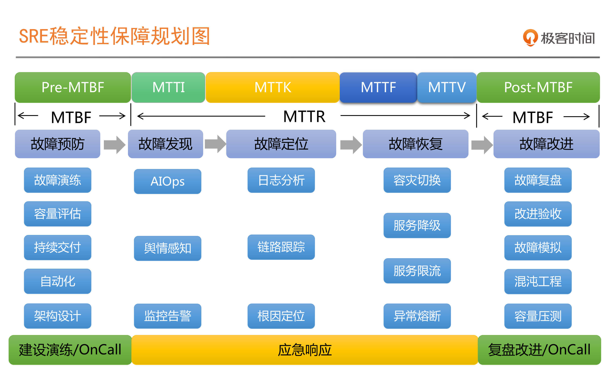
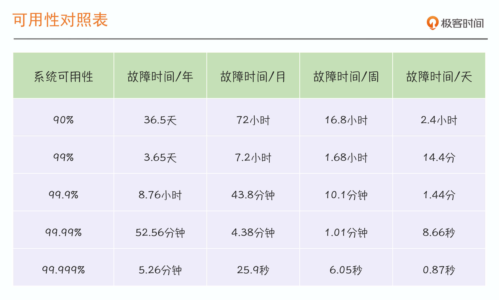
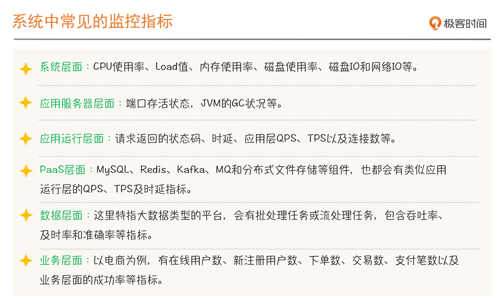
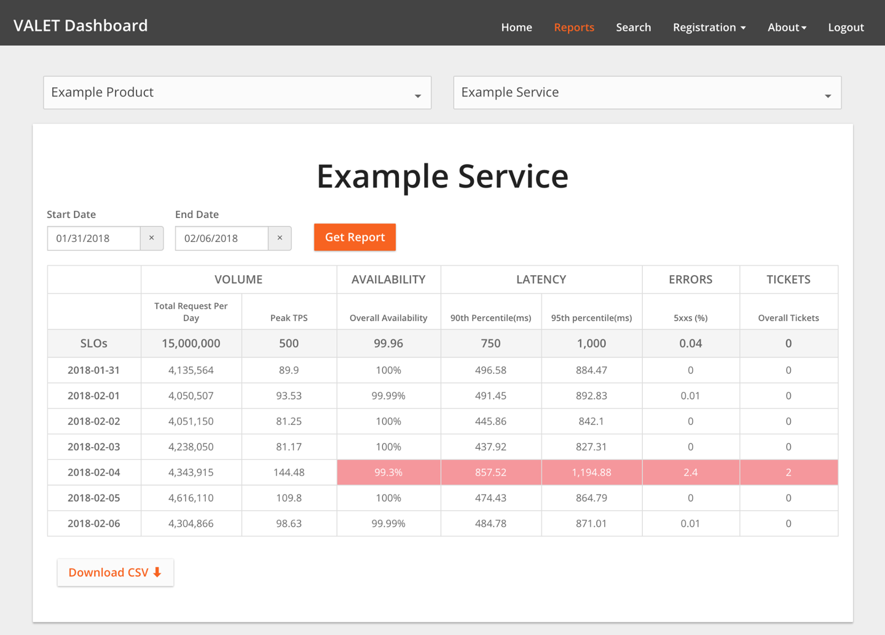
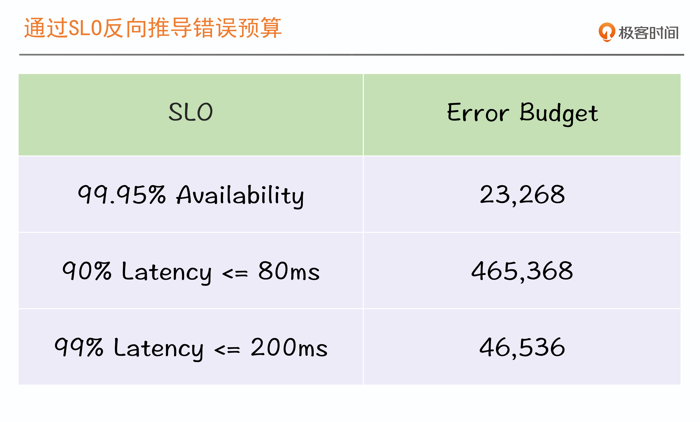
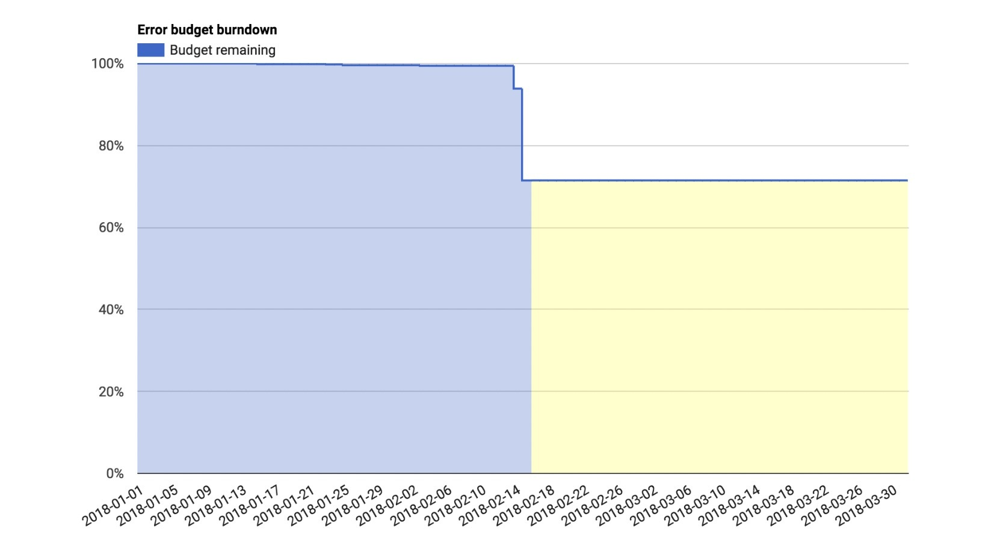
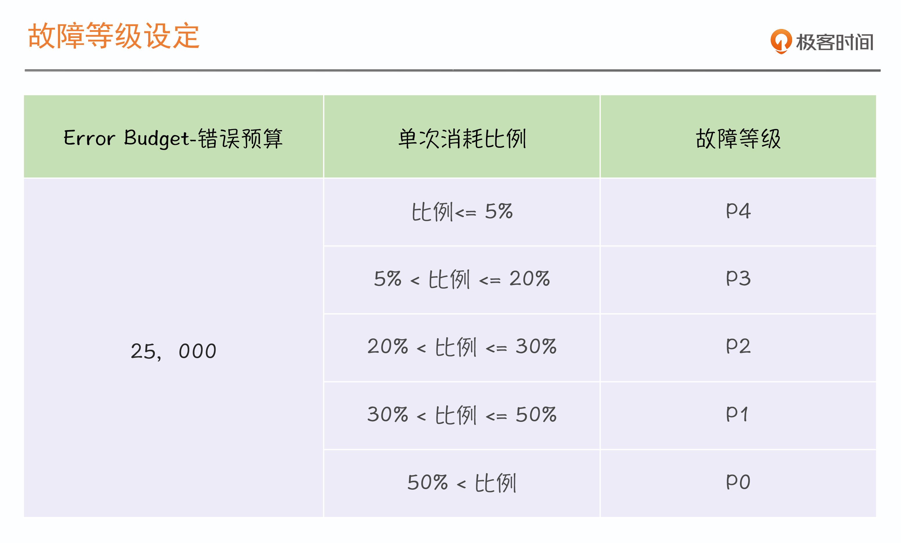

# SRE

摘录于蘑菇街赵成的分享《[SRE 实战手册](https://time.geekbang.org/column/intro/100048201)》《[运维体系管理](https://time.geekbang.org/column/intro/100003401)》。

??? faq "SRE常见问题与困惑？"

    - SRE到底是什么？到底能帮我们解决什么问题？
    - 类似的方法论还有DevOps、AIOps，以及最新的混沌工程（Chaos Engineering），它们之间有什么区别？
    - SRE涉及范围如此之大，我们到底应该从哪里入手建设呢？
    - 在稳定性技术体系的建设上，我们做了大量工作，为什么还是故障频发、频频救火？难道单纯的技术保障还不够吗？
    - 每次出故障，我们都觉得响应速度和处理效率已经很高了，但是为什么业务部门和领导仍然不满意，总是指责我们开发和维护的系统不稳定？
    - 每次故障之后，最害怕的就是开复盘会，开着开着就变成了批斗会，有时候问题还没定位清楚，就开始推诿扯皮谁应该背锅了，真不知道开故障复盘会的目的是什么？
    - 引入了SRE，我们团队的能力应该怎么提升？组织架构应该怎么匹配呢？
    - SRE的要求这么高，作为个人，我应该如何提升自己的能力达到SRE的要求？
    - SRE无所不能的角色？还是运维运维的升级？
    - 没有故障，系统就一定是稳定的吗？

以下为个人消化理解后的笔记。

## 一、夯实基础

稳定性的标准。

### 1.1 统一共识

> 术语

- **MTBF**，Mean Time Between Failure，平均故障时间间隔。

- **MTTR**，Mean Time To Repair，故障平均修复时间。

  - **MTTI**，Mean Time To Identify，平均故障发现时间。

  - **MTTK**，Mean Time To Know，平均故障认知时间。

  - **MTTF**，Mean Time To Fix，平均故障解决时间。

  - **MTTV**，Mean Time To Verify，平均故障修复验证时间。

### 1.2 衡量标准

#### 1.2.1 衡量方式

业务衡量系统可用性的两种方式：

- **时间纬度**：Availability = Uptime / (Uptime + Downtime)。
- **请求纬度**：Availability = Successful request / Total request。

===  "时间纬度三要素"

    1. 衡量指标，如系统请求状态码。
    2. 衡量目标，如非5xx占比成功率达到95%。
    3. 持续时长，持续10分钟。

===  "请求纬度三要素"

    1. 衡量指标
    2. 衡量目标
    3. 统计周期

故障一定意味着不稳定，但是不稳定，并不意味着一定有故障发生。

#### 1.2.2 评估因素

> 三因素

1. 成本因素，ROI 投入产出比，稳定性要求越高投入会越大。
2. 业务容忍度，核心系统优先保障，非核心系统不影响主业务流程。
3. 系统当前的稳定状况，定一个合理的标准比定一个更高的标准会更重要。

SRE关注的稳定性是系统的整体运行状态，而不仅仅只关注故障状态下的稳定性，在系统运行过程中的任何异常，都会被纳入稳定性的评估范畴中。

#### 1.2.3 设定过程

> 术语

- **SLI**，Service Level Indicator。如状态码为非5xx的比例。
- **SLO**，Service Level Objective。如大于等于99.95%。

SLO是SLI要达成的目标。

合理对指标分层，不是所有指标都是适合做SLI指标。

> 选择SLI的两大原则

1. 选择能够标识一个主体是否稳定的指标，如果不是这个主体本身的指标，或者不能标识主体稳定性的，就要排除在外。
2. 针对电商类有用户界面的业务系统，优先选择与用户体验强相关或用户可以明显感知的指标。

快速识别SLI指标的方法：Google - **VALET**。

- **V** - Volume，容量。
- **A** - Availablity，可用性。
- **L** - Latency，时延。需要合理置信区间。
- **E** - Errors，错误率。
- **T** - Tickets，人工介入。低效现象。

> SLO计算可用性

- 直接根据成功的定义计算，Successful = （状态码非5xx）&（时延 <= 80ms 。常用在SLA。
- SLO方法计算，Availability = SLO1 & SLO2 & SLO3。
  - SLO1，99.95%状态码成功率
  - SLO2，90% Latency <=80ms
  - SLO3，99% Latency <=200ms

[Reference](https://sre.google/workbook/slo-document/)

#### 1.2.4 Error Budget

> 应用场景

- 稳定性燃尽图
- 故障定级
- 稳定性共识机制
- 基于错误预算的告警

告警应该是具有指导意义。

> SLO是需要不断校准的

| 核准情况 | SLO完成度 | 人工投入度 | 用户满意度 |
| -------- | --------- | ---------- | ---------- |
| 收紧SLO  | Met       | Low/High   | Low        |
| 放宽SLO  | Missed    | Low/High   | High       |
| 保持现状 | Met       | Low        | High       |

在SLO可以达成的情况下，尽最大化提升用户价值交付效率，围绕这个终极目标不断优化自己的SLO和错误预算策略。

<u>关键内容</u>

- 错误预算是通过SLO推导出来的，为了达成SLO，就要尽量减少对它的消耗。
- 错误预算的警示效果更显著，所以我们通常围绕它来开展稳定性保障工作。落地错误预算可以遵循一些基本原则，比如要对系统故障或问题有容忍度，在预算消耗过快或消耗殆尽之前，SRE有权踩踩”刹车“，减少或拒绝线上变更等等，这些策略要自上而下达成共识。
- SLO和错误预算是否合理，基于它们的策略是否有效，我们可以通过SLO达成情况、人肉投入程度和用户满意度三个维度进行评估，进而调整和优化它们。

#### 1.2.5 SLO原则

> 四原则

1. 核心应用的SLO要更严格，非核心应用可以放宽。
2. 强依赖之间的核心应用，SLO要一致。
3. 弱依赖中，核心应用对非核心的依赖，要有降级、熔断和限流等服务治理手段。
4. Error budget策略，核心应用的错误预算要共享，就是如何某个核心应用错误预算消耗完，SLO没有达成，那整条链路原则上是要全部暂停操作的。

#### 1.2.6 验证SLO

> 两种手段

1. 容量压测
2. 混沌工程（Chaos Engineering）

混沌工程是SRE稳定性建设的高级阶段，一定是SRE体系在服务治理、容量压测、链路跟踪、监控告警、运维自动化等相对基础和必需的部分非常完善的情况下才会考虑的。

#### 1.2.7 验收时机

参考Google建议

- 错误预算充足
- 评估模拟影响

生产系统的稳定性在任何时候都是最高优先级要保证的，决不能因为演练导致系统异常或故障，这也是不被允许的。所以一定要选择合适的时机，在有充分准备和预案的情况下实施各类验证工作。

## 二、最佳实践

处理故障和组织架构。

### 2.1 发现故障

故障修复流程：MTTI --> MTTK --> MTTF --> MTTV

按经验故障修复过程时间从多到少： MTTK > MTTI > MTTF > MTTV

> 当故障发生时

- 判断出现的问题是不是故障
- 确定由谁来响应和召集

#### 2.1.1 On-Call

> 执行On-Call

- 稳定性SLO告警高于一般告警
- 无稳定性SLO告警时降低一般告警的响应级别
- 确保关键角色必须在线随时应急响应

> On-Call流程五步法

1. 确保关键角色在线
2. 组织War Room应急组织
3. 建立合理的呼叫方式
4. 确保资源投入的升级机制
5. 与云厂商联合的On-Call

熟悉某个系统的最快最好的方式就是参与On-Call，而不是看架构图和代码。

### 2.2 处理故障

在故障处理过程中采取的所有的手段和行动，一切以恢复业务为最高优先级。

#### 2.2.1 故障管理

> 故障发生和持续蔓延三个原因

1. 故障隔离手段缺失：限流、降级和熔断，Design-For-Failure高可用设计。
2. 关键角色和流程机制缺失：明确分工、关键角色、共同决策和反馈通报。
3. 没有演练

#### 2.2.2 有效机制

> 关键角色分工

- **IC** - Incident Commander 故障指挥官
- **CL** - Communication Lead 沟通引导
- **OL** - Operations Lead 运维指挥
- **IR** - Incident Responders 执行人员

> 高效的流程机制

> 有效的反馈机制

- 固定时间反馈：10-15分钟
- 没有进展也要反馈

### 2.3 复盘故障

从故障中学习和提升。

#### 2.3.1 复盘前提

- 旨在改进，规避问题，不是追责
- 结合Timeline：解决四过程时间消耗分布
- 跟进后续改进效果

#### 2.3.2 黄金三问

- 故障原因有哪些？

- 我们做什么，怎么做才能确保下次不会再出现类似故障？

- 当时如果我们做了什么，可以用更短的时间恢复业务？

#### 2.3.3 判定原则

- 健壮性原则
- 第三方默认无责
- 分阶段原则

故障是系统运行常态，正常才是特殊状态。

平常心看待故障，辩证的看待故障，鼓励改进，而不是处罚错误。

### 2.4 组织架构

组织架构要与技术架构相匹配。

SRE是微服务和分布式架构的产物。

> 云原生四要素

1. 微服务
2. 容器
3. DevOps/SRE
4. 持续交付

> 角色

- PE - Production Engineer

- 工具平台开发

- 稳定性平台开发

## 三、作者原讲

[个人笔记](../images/sre/sre.png)

[01｜SRE迷思：无所不能的角色？还是运维的升级？](50-sre-01.md)

[02 | 系统可用性：没有故障，系统就一定是稳定的吗？](50-sre-02.md)

[03 | SRE切入点：选择SLI，设定SLO](50-sre-03.md)

[04 | 错误预算：达成稳定性目标的共识机制](50-sre-04.md)

[05 | 案例：落地SLO时还需要考虑哪些因素？](50-sre-05.md)

[06 | 故障发现：如何建设On-Call机制？](50-sre-06.md)

[07｜故障处理：一切以恢复业务为最高优先级](50-sre-07.md)

[08｜故障复盘：黄金三问与判定三原则](50-sre-08.md)

[09｜案例：互联网典型的SRE组织架构是怎样的？](50-sre-09.md)

[10 | 经验：都有哪些高效的SRE组织协作机制？](50-sre-10.md)
