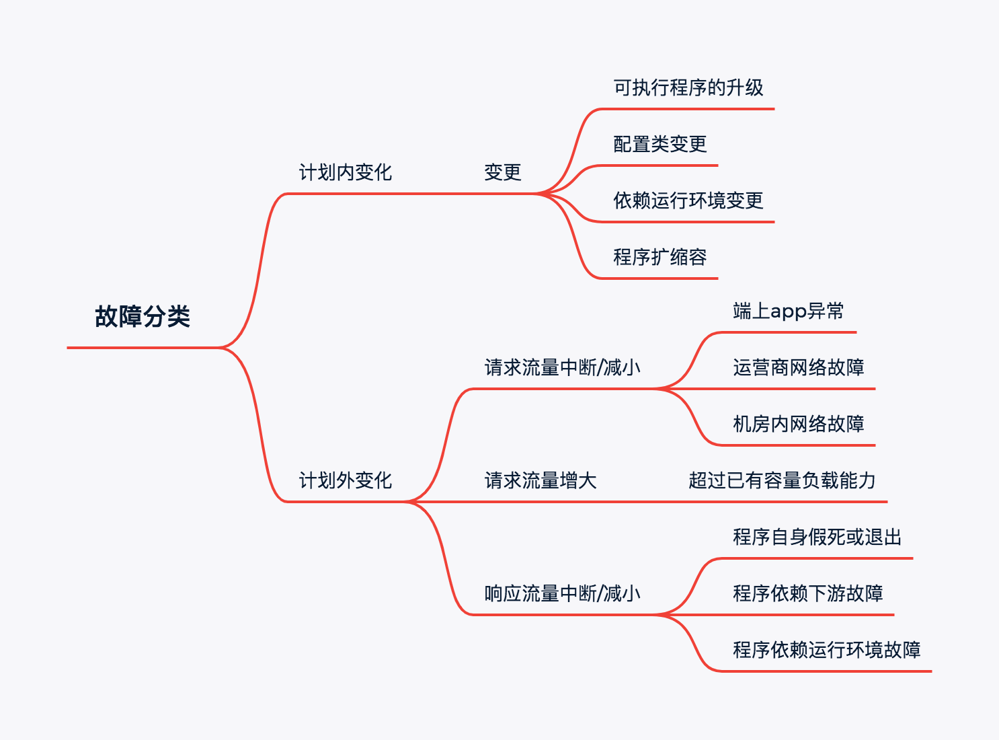
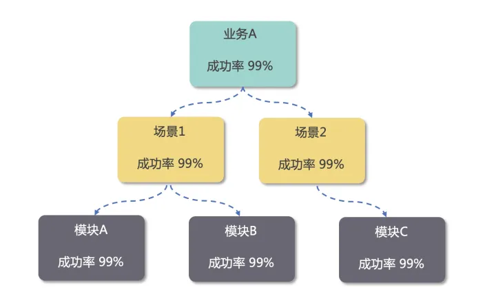
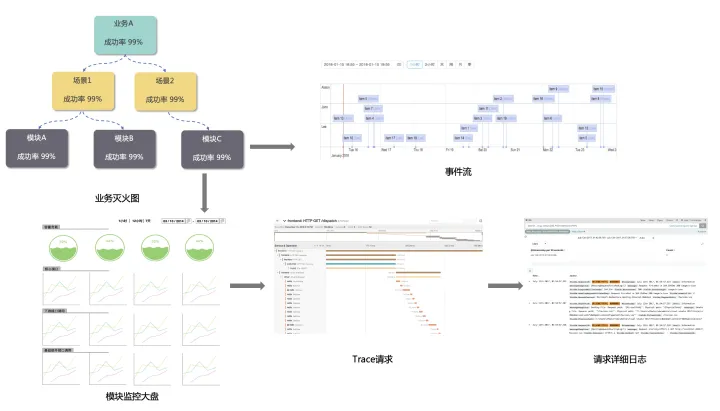
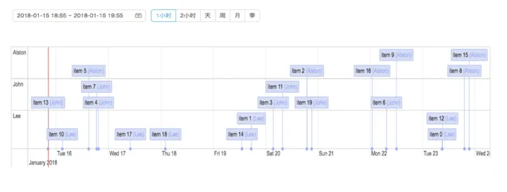
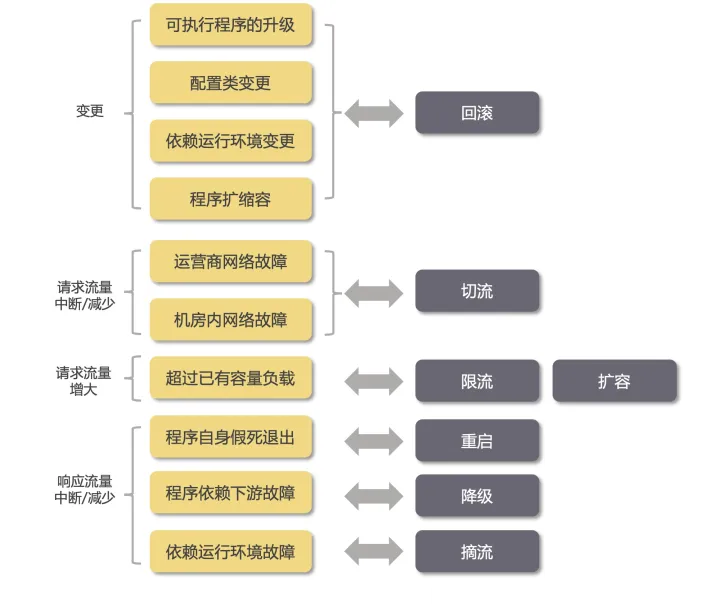

# 稳定性思考

源自于滴滴分享

[Reference](https://zhuanlan.zhihu.com/p/435412032)

## 一、笔记整理

[梳理笔记](../images/sre/didi/sre.png)

## 二、关键内容

### 2.1 故障分类

### 2.2 有效预防

- 计划内变化
- 计划外变化

### 2.3 发现问题

- Logging
- Tracing
- Metrics

区分稳定性、告警、通知、事件

告警内容是具有指导意义的

- 告警误报，误报会造成狼来了效应
- 告警太多，海量消息等于没有消息

- 确保可达，触达到oncall人员

### 2.4 定位

> 灭火图

> 寻因

> 事件序列

### 2.5 止损

### 2.6 复盘

首先我们思考下，为什么要复盘，我理解主要有以下几点

- 提升业务程序的健壮性
- 优化应急响应流程
- 发挥警示作用，记录为知识库，定期回顾
- 以复盘为契机，提高业务对稳定性的重视程度

基于上面复盘的目的，我们可以整理出下面的复盘模板

- 整理故障发生到结束的整个时间线上发生的事情
- 记录从故障发生到发现、从发现到定位、从定位到止损花费的时间，思考如何减少这些时间
- 记录导致故障的原因是什么，根因是什么
- 思考后续如何避免类似的问题
- 思考处理流程有哪些优化的地方
- 思考辅助平台有哪些可以优化的地方
- 输出后续整改计划，记录到公司内部的 todo 管理平台，跟踪完成情况